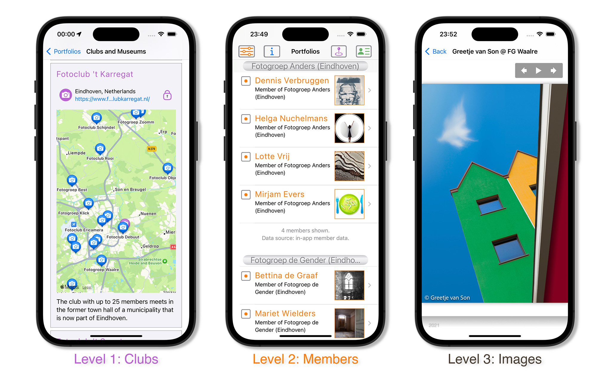
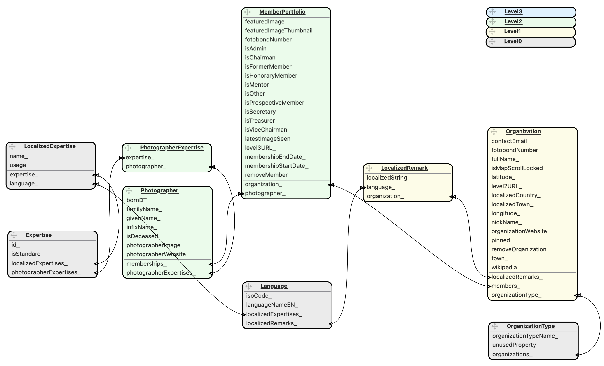

<div id="top"></div>

[![Version][stable-version]][version-url]
[![Contributors][contributors-shield]][contributors-url]
[![Forks][forks-shield]][forks-url]
[![Stargazers][stars-shield]][stars-url]
[![Issues][issues-shield]][issues-url]
[![Discussions][discussions-shield]][discussions-url]
[![MIT License][license-shield]][license-url]



<!-- TABLE OF CONTENTS -->
## Table of Contents
<ul>
    <a href="#about-the-project">About the Project</a>
          <ul>
            <li><a href="#the-app">The App</a></li>
            <li><a href="#photo-clubs">Photo Clubs</a></li>
          </ul>
    </p>
    <a href="#the-user-interface-screens">The User Interface Screens</a>
          <ul>
            <li><a href="#the-portfolios-screen">The Portfolios Screen</a></li>
            <li><a href="#the-organizations-screen">The Organizations Screen</a></li>
            <li><a href="#the-images-screen">The Images Screen</a></li>
            <li><a href="#the-preferences-screen">The Preferences Screen</a></li>
            <li><a href="#the-readme-screen">The Readme Screen</a></li>
            <li><a href="#the-whos-who-screen">The Photographers Screen</a></li>
            <li><a href="#the-prelude-screen">The Prelude Screen</a></li>
          </ul>
    </p>
    <details open><summary><a href="#features">Features</a></summary>
        <ul>
            <li><a href="#multi-club-support">Multi-club Support</a></li>
            <li><a href="#website-generation">Website Generation</a></li>
            <li><a href="#searchable-lists">Searchable Lists</a></li>
            <li><a href="#photo-museums">Photo Museums</a></li>
            <li><a href="#photographer-expertises">Photographer Expertises</a></li>
            <li><a href="#pull-down-to-refresh">Pull down to Refresh</a></li>
            <li><a href="#fancy-scrolling">Fancy scrolling</a></li>
        </ul>
    </details>
    <details open><summary><a href="#adding-photo-clubs-to-the-app">Adding Photo Clubs to the App</a></summary>
        <ul>
            <li><a href="#levels">Levels</a></li>
            <li><a href="#levels-and-screens">Levels and Screens</a></li>
            <li><a href="#level-0-expertises-and-languages">Level 0. Expertises and Languages</a></li>
            <li><a href="#level-1-adding-clubs">Level 1. Adding Clubs</a></li>
            <li><a href="#level-2-adding-members">Level 2. Adding Members</a></li>
            <li><a href="#level-3-adding-images">Level 3. Adding Images</a></li>
        </ul>
    </details>
    <details open><summary><a href="#installation">Installation</a></summary>
         <ul>
            <li><a href="#built-with">Built-With</a></li>
            <li><a href="#cloning-the-repository">Cloning the Repository</a></li>
            <li><a href="#code-signing">Code Signing</a></li>
            <li><a href="#updating-the-app">Updating the App</a></li>
         </ul>
    </details>
    <a href="#contributing">Contributing</a>
           <ul>
                <li><a href="#developer-contributions">Developer contributions</a></li>
                <li><a href="#other-contributions">Other contributions</a></li> 
           </ul>
    </p><details><summary><a href="#the-app-architecture">The App's Architecture</a></summary>
           <ul>
               <li><a href="#role-of-the-database">Role of the Database</a></li>
               <li><a href="#the-data-model">The Data Model</a></li>
               <ul>
                     <li>Organization</li>
                     <li>Photographer</li>
                     <li>MemberPortfolio</li>
                     <li>OrganizationType</li>
                     <li>Language</li>
                     <li>LocalizedRemark</li>
               </ul>
               <li><a href="#how-data-is-loaded">How Data is Loaded</a></li>
               <ul>
                    <li>The Old Approach</li>
                    <li>The New Approach</li>
                    <ul>
                        <li>Level 1: central list of photo clubs</li>
                        <li>Level 2: local lists of photo club members</li>
                        <li>Level 3: local image portfolios per club member</li>
                    </ul>
               </ul>
               <li><a href="#when-data-is-loaded">When Data is Loaded</a></li>
               <ul>
                    <li>Background Threads</li>
                    <li>SwiftUI View Updates</li>
                    <li>Core Data Contexts</li>
                    <li>Comparison to SQL Transactions</li>
              </ul>
           </ul>
    </details>
    <details><summary><a href="#administrative">Administrative</a></summary>
        <ul>  
            <li><a href="#license">License</a></li>
            <li><a href="#contact">Contact</a></li>
            <li><a href="#acknowledgments">Acknowledgments</a></li>
        </ul>
    </details>
</ul>

## About the Project

### The App

This iOS app showcases photographs made by members of photography clubs.
It thus serves as a permanent online gallery with selected work by these photographers.</p>

The app allows viewers to see images from multiple clubs within one app.
This gives a degree of uniformity, thus sparing the user from having to find a club's website, 
discovering where to find the photos within the site and how to browse through the portfolios.
   
To achieve this, the app fetches online lists of photo clubs, lists of club members and their curated photos. 
This ensures that photo clubs, club members and their portfolio's can be added and updated without requiring a change to the app software.
In addition, this also allows the clubs to manage their own data.</p>

There is a <a href="#adding-photo-clubs-to-the-app">chapter</a> below on how to add a club's data in 
3 distict "`Levels`" (steps).

### Photo Clubs

> The app showcases curated images made by members of photo clubs.

Photo clubs are thus the distinguishing feature of this app.

You can first look up a photo club and then find its members in the `Portfolio` screen. 
Or you can alternatively look up a photographer and then the associated photo club in the `Photographers` screen.
Either way, once you have chosen a photographer-and-club combination, you can view the photo portfolio of that club member.

<ul><details><summary>Details (click to expand)</summary></p>

Here is a schematic representation of the `Portfolios` screen.
This screen puts the photo club first, and then allows you to select club members and their work:

* photo club _Clickers_ (hosted on `www.PhotoClubClickers.com`)
  * member __Bill__
    * photos by Bill as a a member the Clickers
  * member __John__
    * photos John as a member of the Clickers

* photo club _Zoomers_ (hosted on `www.PhotoClubZoomers.com`)
  * member __John__
    * photos by John as a member of the Zoomers
  * member __Sean__
    * photos by Sean as a member of the Zoomers

<a/></p>

An alternative navigation path is provided by the `Photographers` screen.
This screen puts the photographer first, thus allowing you to find a photographer even if you don't
know the name of the club (or clubs) the photographer is associated with:

* photographer __Bill__
  * photo club _Clickers_ (hosted on `www.PhotoClubclickers.com`)
      * photos by Bill as a member of the Clickers

* photographer __John__
  * photo club _Clickers_ (hosted on `www.PhotoClubClickers.com`)
      * photos by John as a member of the Clickers
  * photo club _Zoomers_ (hosted on `www.photoclubzoomers.com`)
      * photos by John as a member of the Zoomers 

* photographer __Sean__
    * photo club _Zoomers_ (hosted on `www.PhotoClubZoomers.com`)
        * photos by Sean as a member of the Zoomers
   
<a/></p>

For comparison, traditional personal websites stress the photographer's images, without any reference to clubs:
    
* website for __Bill__ (hosted on `www.BillIsAwesome.com`)
  * photo gallery with portraits
    * portrait photos by Bill
  * photo gallery with landscapes
    * landscape photos by Bill

* website for __John__ (hosted on `www.JohnIsAwesomeToo.com`)
  * photo gallery with macros
    * macro photos by John
  * : 

### Implications
<ul><details>
<summary>Details (click to expand)</summary></p>

If a photographer joined *multiple* photo clubs, the app can show *multiple* portfolios (with independent
content) for that photographer - one per photo club. This could mean that the photographer is currently 
a member of _two_ different clubs. But it could also mean that a photographer left one club and joined another club.
Or variations of these scenarios.</p>

> In all cases, the `portfolio` concept groups the images both by photographer and by photo club. </p>

The app is thus not intended as a personal website replacement, but it can have links to a photographer's personal website.
Furthermore, nothing prevents you from supporting an online group of photography friends - assuming
that they are interested in organizing this together.

You could even consider yourself a one-person club and put your images in a single portfolio below that club.
Or you could use the club level to group a few individual photographers (by region or interest) as long as the members
of this non-club are willing to align (e.g. maintain the list of portfolios=photographers who are then a member of a loosely-knit club).
<a/></p></ul>
</detail></ul></detail>

</ul>
<p align="right">(<a href="#top">back to top</a>)</p>
 
## The User Interface Screens

Usage of the various screens in the user interface:
<ul>

### The `Portfolios` Screen

The `Portfolios` screen lists all the photo clubs featured by the app.
It allows you to first select a photo club and then select the portfolio of one of its members.
The `Search` bar filters the lists of club members using the photographer's full name.
Swiping left deletes an entry, but this is not normally needed and is not permanent (yet)).


### The `Organizations` Screen

The `Organizations` screen lists all photo clubs that are known to the app.
Each entry predominantly contains a map showing where the club is located and optionally your current location.
A button with a lock icon toggles whether the map is can be controlled interactively (scroll, zoom, rotate, 3D).
By default, the maps are not interactive. This mode helps scroll through the list of clubs rather than scrolling within a map.
A _purple_ pin on the map shows where the selected club is based (e.g., a school or municipal building).
A _blue_ pin shows the location of any other photo club that happens to be in the displayed region.
The screen can also show any photo museums that happen to be in sight. These have different markers than the photo clubs.
The plan is that the screen can switch between listing all photo clubs and listing all photo museums.


### The `Images` Screen

The `Images` screen displays one portfolio (of one photographer associated with one club.
It can be reached by tapping on a `portfolio` in either the `Portfolios` or the `Photographers` screen.
The title at the top of the screen shows the selected photographer and selected club affiliation:
"Jane Doe @ Club F/8".


Images are shown in present-to-past order, based on the images's _capture_ date.
For Fotogroep Waalre, the year the image was made is shown in the caption.

You can _swipe_ left or right to manually move backwards or forwards through the portfolio.
There is also an _autoplay_ mode for an automatic slide show. This screen is (for Fotogroep Waalre)
currently based on a Javascript plug-in (`Juicebox Pro`) that is normally used in website creation.

### The `Preferences` Screen

The `Preferences` screen allows you to configure which types of portfolios you want to include in the
`Portfolios` screen. You can, for example, choose whether to show former members.
The `Preferences` screen probably should also filter the `Photographers` screen - but it doesn't yet.


### The `Readme` Screen

The `Readme` screen contains background information on the app and info on app usage.


### The `Photographers` Screen

The `Photographers` screen lists all the photographers known to the app.
It allows you to first select the photographer and then select that person's club-specific portfolio.
If available, club-independent information (like birthdays) for that photographer is displayed here.
The `Search` bar filters on photographer names.


### The `Prelude` Screen

The `Prelude` screen shows an opening animation.
Clicking outside the central image brings you to the central `Portfolios` screen.


<ul><details>
<summary>Details about Prelude screen (click to expand)</summary></p>

When the app launches, it shows a large version of the app’s icon. 
Tapping on the icon turns it into an interactive image illustrating how most digital cameras detect color.</p>

> This involves a [Bayer color filter array](https://en.wikipedia.org/wiki/Bayer_filter)
> that filters the light reaching each photocell or pixel.
> In a 24 MPixel camera, the image sensor typically consist of an array of 4000 by 6000 photocells.
> Each photocell on the chip itself is not color-sensitive. But by placing a miniscule red, green of blue color filter on
> cop, it because best at seeing one specific color range. Thus in most cameras, only one color is measured per
> pixel: the two missing color channels for that pixel are estimated using color information from surrounding pixels.

Tapping *inside* the image allows you to zoom in or out to your heart's content.
Tapping *outside* the image brings you to the central screen of the app: the `Portfolios` screen.

You will see the Prelude animation after you shut down and restart the app.
On wide screens (iPad, iPhone Pro Max) you can see the animation again using an extra navigation button at the top of the screen.

Why provide such a fancy opening screen? Well, it was partly a nice challenge to make (it actually runs
on your device's GPU cores). But it also helps explain the app's logo: the Bayer filter array indeed consists of an array of repeated
red, blue, and _two_ green pixels.
</details>
    
</ul></ul>
<p align="right">(<a href="#top">back to top</a>)</p>
 
## Features
<ul>

### Multi-club Support

Version 1 of the app only supported Photo Club Waalre (known as *Fotogroep Waalre* in Dutch).
Version 2 added support for multiple photo clubs. This means:

- all clubs in the system are technically handled in the same way (although some may have provided more data)
- users can find all supported clubs on the provided maps
- a photographer is shown associated with multiple clubs if applicable (e.g., former club, current club)
- the app is stepwise being prepared for larger amounts of data (data is distributed over sites)
- the app is starting to enable that clubs can manage their own data (data "within" a club is managed by the club)

### Website Generation

A companion app [Photo Club Hub HTML](https://github.com/vdhamer/Photo-Club-Hub-HTML) exists that uses the
same input data used by this app to generate (static) HTML web pages. The companion app generates
static webpages _per club_ that list each club's members and has links to their portfolios.

The webpages per club are collectively equivalent to the Portfolio page in iOS app.
There is no central index page yet to locate the club HTML pages, but this is will be added at some point.
The individual club pages can be easily integrated into existing (e.g. Wordpress), websites maintained by
the individual clubs.

Apart from keeping websites up to date using the available Photo Club Hub data, the HTML version provides an alternative
for "the rest of us" who don't own an iPhone or an iPad.
The HTML version also covers the cases where someone wants to view the  the information or photos on a laptop or desktop computer.

### Searchable Lists

The three screens with long lists (`Portfolios`, `Organizations`, `Photographers`) each have a Search Bar
where you can enter what you are looking for. This reduces the list to items that match that filter criterion.</p>

<details><summary>Details on the Search Bar(click to expand)</summary></p>

On an iPad, the search bar is always visible and at the top of the screen. 
On an iPhone, scroll up rapidly until you hit the top of the list.

The text you type inside the search bar is matched against key fields for the records shown in the list.

- In the `Portfolios` screen, a search scans photographers' full names.
  Searching on `Jan` might return `Jan Stege`, `Ariejan van Twisk` and `Jos Jansen`.
  If you need to search on club names, go to the `Organizations` screen.
- In the `Organizations` screen, searches try to match against the organization names and towns.
  Searching on `Ber` might match `FFC Shot71 (Berlicum)` and `Museum für Fotografie (Berlin)` and `The Victoria & Albert Museum (London)`.
  Note that the town is the location specified in the `root.level1.json` file and _not_ its translated version, which can be different.
- In the `Photographers` screen, searches try to match the photographer's full name.
  Searching on `Jan` might return `Jan Stege`, `Ariejan van Twisk` and `Jos Jansen`.

Design detail: Search Bar filtering is done in the app's user interface and not by the CoreData database.
</details>

### Photographer Expertises

</p>Photographers can be associated with expertises describing what kind of photography they are mainly known for.
Examples: "Black & White" or "Landscape". Because these expertises can serve to Search for photographers with similar
interests, the expertises are standardized (e.g. consistently use "Black & White" rather than a mix with "B&W" or "Black and White"). 
</p>

<details><summary>Details on Expertise Standardization (click to expand)</summary></p>

Standardization also helps in displaying the texts in multiple languages. 
The translations are defined in a single file named `Level 0`. 
This means that if the Sierra Club associates their member Ansel Adams with "Black & White"
they automatically get translations of "Black & White" into certain languages:
if the app is thus set to Dutch, the user sees "Zwart-Wit" rather than "Black & White".

Information on how to define expertises per photographer and how to define standardized expertises can be found in
the explanations about adding `Level 2` data and maintaining `Level 0` data respectively.
</details>

### Photo Museums

</p>The maps showing the location of photo clubs also show the locations of selected photo museums.</p>

<details><summary>Details on Museums (click to expand)</summary></p>

A photo museum is not a photo club and is displayed on the maps using a dedicated marker.
Techncially, the app doesn't allow museums to have "members" that share images with the museum.</p>

Consider the showing of museums a bonus that may interest some users.
You are welcome to add a favorite photo museum via a GitHub Pull Request. It only requires extending a JSON file.
The file format is documented below under [How Data is Loaded](#how-data-is-loaded).
</details>

### Pull down to Refresh

The top of the `Portfolios` screen as well as two other screens can be dragged down to force a refresh of all app data.
Refreshing is usually not needed, but can be used to remove database records
that were downloaded earlier but are no longer in use.
The feature is a fast alternative to uninstalling and reinstalling the app:
the database gets cleared and the missing data immediately gets downloaded again.
</p>

<details><summary>Details on Data Synchronization (click to expand)</summary></p>
Whenever the app is launched, it fetches fresh information from online servers.
The use of online data ensures that the app stays up-to-date with respect to the online lists
with clubs and museums (`Level 1`), club members (`Level 2`) and portfolio photos (`Level 3`).</p>

This fresh online data is merged with an on-device data (`CoreData`) consisting of a persistent copy of the data
received during earlier app runs. This data merging thus updates the on-device database.  
The app's user interface is immediately updated whenever the database is updated.</p>

A problem could occur when a club (or museum or member) is deleted in the online version of the information.
Let's say, for example, that the club's identifying name or town got edited in the `Level` 1 list.
This means that the online list now contains a "different" club: one with another identifying name/town combination.
Unfortunately the app has now way of knowing that this "new" club is actually the same as the club that seemingly vanished.
So, from the app's perspective, the original club vanished and a new club appeared as two separate events.
The new club simply need to be loaded. But the app currently doesn't detect the disappearance of the orignal club.</p>

There is a GitHub ticker to add future automatic detection of "disappeared" or renamed clubs. </p>

A temporary workaround is to use the _pull down to refresh_ feature: 
it simply deletes the entire content of the database and then reloads.
This fully synchronizes the device's internal (CoreData) database with the online data.
Alternatively, the user could delete the app and reinstall it.</p>

Another application of _pull down to refresh_ is to force a reload of online data when you know that the online data just changed.
</details>

### Fancy scrolling

The _Organizations_ and _Photographers_ screens try to prevent showing partial maps or partial photographer info.
</p>

<details><summary>Details about smart scrolling</summary></p>

Apple introduced `ScrollTargetBehavior` for SwiftUI's `ScrollViews` in iOS 17.
It allows the app to control where on the page a scroll motion comes to a stop,
thus avoiding the display of a list section with some of the top information not visible.
</p>
    
In iOS 17 this feature assumed that the screen consists of a list of items of equal height.
Because iOS 18 can apparently handle list items with varying height, 
the app's fancy scrolling content looks slightly better under iOS 18.
</p>

Unfortunately, the _Portfolios_ screen doesn't provide this fancy scrolling feature 
because it relies on a "segmented List" view rather than on `ScrollView`.
So we had to choose between removing segmentation or not providing fancy scrolling for the `Portfolios` screen.
</details>
</ul>
<p align="right">(<a href="#top">back to top</a>)</p>

## Adding Photo Clubs to the App

> The app is designed so that the required information about photo clubs is provided
and maintained by the clubs themselves. 

This is important because this allows the app to **support many clubs**.
But is also also necessary in order to give clubs **control** over their data:
a club knows best what to mention regarding the club, who the current members are,
who the club officials are, and which images the members want in their portfolios.
<ul>
    
### Levels

The app distinguishes 4 hierarchical layers of information:

- `Level 0` consists of reference data (like a list of `Languages`). Consider this level an implementation detail.
- `Level 1` consists of the club names and geographic locations.
- `Level 2` lists the members per club.
- `Level 3` links to portfolios per club member.</p>

We call these layers of information `Levels` because, like a game, you can only reach a level after you completed all lower levels.
And - again like a game - reaching a particular level "unlocks" extra app functionality for that club.

A club can take as long as they want (days, weeks, months) before proceeding to the next level.
This means that an app user may find clubs at different `Levels` throughout the app.
To the user this simply means that some clubs have shared more information than others. 

Museums are handled in pretty much the same way as photo clubs, but only `Level 1` is applicable for museums.
So you won't find members of a museum or portfolios associated with these members.

Internally the app actually supports one extra level of data:

- `Level 0` holds some basic configuration data.</p>

Users and clubs don't normally need to worry about this layer. `Level 0` data is shared across clubs and thus managed centrally. 
Its main content is a list of supported expertises for photographers, plus translations of these expertises into supported languages.

### Levels and Screens


When a club is at `Level 1`, it shows up as a marker on the maps (leftmost screenshot).
This is because the app knows the club's name and the latitude/longitude where it is based.

For clubs at `Level 2`, the app also knows the names and optional roles of club members.
As illustrated in the center screenshot, the club and its members are now shown on the `Portfolio` and `Photographers` screens.
Clubs with zero members (as far as the app is concerned) are _not_ shown on either screens.

For clubs at `Level 3`, the app is aware of the image portfolios of club members (rightmost screenshot), 
and allows app users to browse member photos.
Technically different club members don't need to reach `Level 3` at the same time: you can first add a test portfolio for
one member, then expand to all members, and later add recent former members if you want. 
Attempting to view a portfolio of a club member without an available portfolio will display a red built-in placeholder image.

### Level 0. Expertises and Languages

`Level 0` contains supported expertises, supported languages, and the translations of expertises into these languages.
You may want to skip reading about `Level 0` on a first reading, as it only describes data needed to support an optional feature.

<ul><details><Summary>Level 0 example (click to expand)</Summary>

``` json
{
    "expertises": [
        {
            "idString": "Landscape",
            "name": [
                { "language": "EN", "localizedString": "Landscape" },
                { "language": "NL", "localizedString": "Landschap" },
                { "language": "AR", "localizedString": "منظر جمالي" }
            ]
        },
        {
            "idString": "Black & White",
            "name": [
                { "language": "EN", "localizedString": "Black & White" },
                { "language": "NL", "localizedString": "Zwart-wit" }
            ],
            "optional": {
                "usage": [
                    { "language": "EN", "localizedString": "Grayscale, sepia or other monochrome images" }
                ]
            }
        }
    ],
    "languages": [
        {
            "isoCode": "EN",
            "languageNameEN": "English"
        },
        {
            "isoCode": "NL",
            "languageNameEN": "Dutch"
        },
        {
            "isoCode": "AR",
            "languageNameEN": "Arabic"
        }
    ]
}
```
</details></ul>

<ul><details><Summary>Mandatory Level 0 fields (click to expand)</Summary></p>

- `expertises` lists the expertises that can be linked to one or more `photographers` to describe their main genres.
Expertises apply to the photographer in general, and not to the photographer's membership of a particular club.
If multiple clubs assign different expertises to the same photographer, the lists are automatically merged in the app ("union"). 
    - `idString` only serves to identify an expertise. Preferably use the English version of the expertise - but a text like "Expertise #123" will also work.
    - `name` is a list of translations of the expertise into one or more languages.
        - `language` contains the isoCode (typically 2 letters) for the language.
Use the 3 letter code only for uncommon languages for which no 2 letter code exists.
The codes must match the standard [ISO 639 list](https://www.loc.gov/standards/iso639-2/php/English_list.php).
It is important to use the correct values, because `isoCode` is compared to the preference codes provided by iOS.
Example: "DE" is "German".
        - `localizedString` contains the translation of the expertise into the indicated language.
If possible provide translations for the languages that the app supports (currently EN and NL).
Additional translations are fine, and will be used where appropriate.
- `languages` lists the language codes used for localized photographer `expertises` and `remarks` about `organizations`.
    - `isoCode` is the 2 (ISO 639-1) or 3 letter (ISO 639-2) language code for the language. Use the 2 letter codes when available.
    - `languageNameEN` is the name of the language in English. Example: "Chinese". So this can tell you that ZH represents Chinese.
</details></ul>

<ul><details><Summary>Optional Level 0 fields (click to expand)</Summary></p>

- `usage` (within a `expertise`) is a description of the expertise's intended usage.
The optional `usage` text can be defined in multiple languages (preferably at least in EN and NL).
</details></ul>

### Level 1. Adding Clubs

Adding photo clubs (or museums) to get to `Level 1` requires providing a name, location and a few optional URLs. 
This enables the app to list the items on the `Organizations` screen and display them using location markers on the maps.

`Level 1` data is technically stored in a _single_ `root.level1.json`
[file](https://github.com/vdhamer/Photo-Club-Hub/blob/main/JSON/root.level1.json)
that is centrally hosted.
Whenever the app is launched, it updates any outdated on-device data by reading this central online file.

If you send us a club's `Level 1` information, we are happy to add it for you to this central `root.level1.json` file.
However, where possible, we prefer if you provide the change (and any future updates) as a GitHub _pull request_.
This reduces the work required to handle many updates, and reduces the risk of administrative errors.

The same applies if you want to add a photo museum to the central `root.level1.json` file.

<ul><details><Summary>Level 1 example (click to expand)</Summary></p>

Here is an example of the format of the `root.level1.json` file containing only one photo club and one photo museum.

``` json
{
    "clubs": [
        {
            "idPlus": {
                "town": "Eindhoven",
                "fullName": "Fotogroep de Gender",
                "nickName": "fgDeGender"
            },
            "coordinates": {
                "latitude": 51.42398,
                "longitude": 5.45010
            },
            "optional": {
                "website": "https://www.fcdegender.nl",
                "level2URL": "https://www.fcdegender.nl/fgDeGender.level2.json",
                "remark": [
                    { "language": "NL", "value": "Opgelet: Fotogroep de Gender gebruikt als domeinnaam nog altijd fcdegender.nl (van Fotoclub)." }
                ],
                "maintainerEmail": "admin@fcdegender.nl",
                "nlSpecific": {
                    "fotobondNumber": 1620
                }
            }
        }
    ],
    "museums": [
        {
            "idPlus": {
                "town": "New York",
                "fullName": "Fotografiska New York",
                "nickName": "Fotografiska NYC"
            },
            "coordinates": {
                "latitude": 40.739278,
                "longitude": -73.986722
            },
            "optional": {
                "website": "https://www.fotografiska.com/nyc/",
                "wikipedia": "https://en.wikipedia.org/wiki/Fotografiska_New_York",
                "remark": [
                    { "language": "EN", "value": "Fotografiska New York is a branch of the Swedish Fotografiska museum." },
                    { "language": "NL", "value": "Fotografiska New York is een dependance van het Fotografiska museum in Stockholm." }
                ]
            }
        }
    ]
}
```

The actual `root.level1.json` file contains many club and museum records within their respective sections (delimited using `[{},{},{}}]` syntax).
Note the comma's delimiting the array elements - the JSON data format is very picky about missing or extra comma's 
because JSON files are often generated by software rather than by hand.
You can indentally check the basic syntax of JSON files using online JSON validators such as
[JSONLint](https://jsonlint.com).
</details></ul>

<ul><details><Summary>Mandatory Level 1 fields (click to expand)</Summary></p>

- `clubs` and `museums` are required to distinguish photo clubs from photo museums.
  - Syntactially either can be omitted, but then you wouldn't have photo clubs or museums in the app.
    - When loaded into the app's internal database, `clubs` and `museums` determine the `OrganizationType` (`club` or `museum`) of each `Organization` object. This in turn determines which marker type is shown on maps.
- `town` can be a city (London) or smaller locality (Land's End)
  - `town` is _not_ directy visible in the user interface, although it may look that way. The user interface displays a language-localized name generated using the `coordinates`. This co-called `localizedTown` may contain the same string as `town`, or be a translation of `town`, or may even hold larger or smaller administrative entity. The file's `town` field is used to ensure that there is a unique ID for a club or museum. So `Fotoclub Lucifer` in `Vessem` would be considered unrelated to a `Fotoclub Lucifer` in `Eersel`. The `town` field also serves to document the record in the `root.level1.json` file: it is clearer to say "Victoria and Albert Museum (London)" than to say just "Victoria and Albert Museum" and leave you to determine the location using its `coordinates`.
    - Similarly, the user interface can display a computed `localizedCountry` name that is automatically generated using the provided `coordinates`. The Level 1 data thus does not need or include a `country` attribute. This is convenient because country names commonly get translated into local languages (`Italia`, `Italy`, `İtalya`, etc.).
- `town` and `fullName` together serve to identify clubs or museums.
  - It is thus possible to have two clubs with the same name in different cities. Two separate clubs or museums with an identical name in the same town would be confusing, and would be treated as a single entity by the app until the data about the original `town` /` fullname` combination is removed from the in-device database. Removal of obsolete `Organization` records is unfortunately not done automatically yet.
  - Try to avoid changing either string. Because the app doesn't associate the new ID with the original ID, this results in the app displaying two different clubs or museums when the 
- `nickName` is a short version of `fullName` that is displayed in confined spaces such as on maps. It can be any string, but please keep it short.
- `coordinates` is used to draw the club on the map and to [generate](http://www.vdhamer.com/reversegeocoding-for-localizing-towns-and-countries/) localized versions of the names of towns and countries.
- `latitude` should be in the range [-90.0, +90.0] where negative values are used for the Sounthern hemisphere (e.g., Australia).
- `longitude` should be in the range [-180.0, +180.0] where negative values are used for the Western hemisphere (e.g., USA).</p>
</details></ul>

<ul><details><Summary>Optional Level 1 fields (click to expand)</Summary></p>

- `website` holds a URL to the club's general purpose website. It can be opened by the app in a separate browser window.
- `level2URL` (for clubs only) holds the address of the `Level 2` membership list. It is not used yet (April 2024).
- `wikipedia` contains a URL to a Wikipedia page for a museum. It _could_ be used for photo clubs - but Wikipedia pages for photo clubs probably don't/won't exist.
- `remark` contains a brief note with something worth mentioning about the club or museum. The `remark` contains an array of alternative strings in multiple languages. The app chooses one of the provided languages to display based on the device's language setting.
  - `language` is the two or three letter [ISO-639](https://en.wikipedia.org/wiki/List_of_ISO_639_language_codes) code for a language. `EN` is English, `FI` is Finnish.
      - If the device's preferred language doesn't match any of the provided languages, the app will default to EN, if available. If EN is unavailable, it will select one of the available languages.
  - `value` is the text to display for that particular remark in that language.
- `nlSpecific` is a container for fields that are only relevant for clubs in the Netherlands.
  - `fotobondNumber` is an ID number assigned by the Dutch national federation of photo clubs.
  - There used to be a `kvkNumber` as well (Chamber of Commerce) but that was removed because it wasn't worth the effort.
</details></ul></p>

### Level 2. Adding Members

`Level 2` support requires providing a list of the members as a file per club.
A club's `Level 2` data shows up in the Portfolios screen as a list of club members per club.
Each `Level 2` JSON file lists the current (and optionally former) members of a single club.
For each member, a URL is stored pointing to the `Level 3` file (portfolio per member).
`Level 2` lists also includes the URL of an image used as thumbnail for that member.
</p>

_Fotogroep de Gender_ and _Fotogroep Waalre_ in the Netherlands have `.level2.json` files with membership data.
</p>

<ul><details><Summary>Storing Level 2 data (click to expand)</Summary>
</p>

A `Level 2` file needs to be in a JSON format so that the app can interpret the data.
You can check the basic syntax of JSON files using online JSON validators such as
[JSONLint](https://jsonlint.com).
</p>

A `Level 2` file can be located anywhere online, but is by default stored on the a club's existing website.
You could, for example, store it inside an existing _Wordpress_ site using
_Wordpress'_ built-in features for uploading files (called `media` or `library`).
</p>

The files are downloaded in background after app startup using a URL address found within the central `Level 1` file.
</p>
    
The `Level 2` data is loaded in the app's CoreData database on app startup, so that the data is can be displayed even before the
data has been downloaded and the database content has been updated.
</p>

In the future, once there are hundreds or more `Level 2` files available, the app will need to become selective about
which clubs to preload and how often to refresh the `Level2` data.
</p>

</details></ul>

<ul><details><Summary>Level 2 example (click to expand)</Summary></p>

Here is an example of the format of a `Level 2` list for a photo club. This example contains only one member:

``` json
{
    "club":
        {
            "idPlus": {
                "town": "Eindhoven",
                "fullName": "Fotogroep de Gender",
                "nickName": "fgDeGender"
            },
            "coordinates": {
                "latitude": 51.42398,
                "longitude": 5.45010
            },
            "optional": {
                "website": "https://www.fcdegender.nl",
                "wikipedia": "https://nl.wikipedia.org/wiki/Gender_(beek)",
                "level2URL": "https://www.example.com/deGender.level2.json",
                "remark": [
                    {
                        "language": "EN",
                        "value": "Note that Fotogroep de Gender is abbreviated fcdegender.nl for historical reasons."
                    }
                ],
                "maintainerEmail": "admin@fcdegender.nl",
                "nlSpecific": {
                    "fotobondNumber": 1620
                }
            }
        },
    "members": [
        {
            "name": {
                "givenName": "Peter",
                "infixName": "van den",
                "familyName": "Hamer"
            },
            "optional": {
                "roles": {
                    "isChairman": false,
                    "isViceChairman": false,
                    "isTreasurer": false,
                    "isSecretary": false,
                    "isAdmin": true
                },
                "status": {
                    "isDeceased": false,
                    "isFormerMember": false,
                    "isHonoraryMember": false,
                    "isMentor": false,
                    "isProspectiveMember": false
                },
                "birthday": "9999-10-18",
                "website": "https://glass.photo/vdhamer",
                "photographerImage": "http://www.vdhamer.com/wp-content/uploads/2022/07/cropped-2006_Norway_276_SSharp1_4.jpg",
                "featuredImage": "http://www.vdhamer.com/wp-content/uploads/2023/11/PeterVanDenHamer.jpg",
                "level3URL": "https://www.example.com/FG_deGender/Peter_van_den_Hamer.level3.json",
                "membershipStartDate": "2024-01-01",
                "membershipEndDate": "9999-01-01",
                "expertises": [ "Landscape", "Travel", "Minimal" ]
            }
        }
    ]
}
```
</details></ul>

<ul><details><Summary>Mandatory Level 2 fields (click to expand)</Summary></p>

- `club` has the same structure as a single `club` record from the `root.level1.json` file. It serves to label the `Level2` file so you can tell which club it belongs to.
  - `idPlus` and its 3 fields (`town`, `fullName`, and `nickName`) are all required.
  - `town` and `fullName` must exactly match the corresponding fields in the `root.level1.json` file.
- `coordinates` is used to draw the club on the map and to generate localized versions of the names of towns and countries.
  - `coordinates` in the Level 2 file overrule the club's coordinates in the Level 1 file. This allows a club to change the coordinates without any outside help.
  - `latitude` should be in the range [-90.0, +90.0] where negative values are used for the Sounthern hemisphere (e.g., Australia).
  - `longitude` should be in the range [-180.0, +180.0] where negative values are used for the Western hemisphere (e.g., USA).
- `members` is a list with the club's current and optionally former members.</p>

</details></ul>

<ul><details><Summary>Optional Level 2 fields (click to expand)</Summary></p>

- **Optional** fields (that are ignored)
    - the `level2URL` field can be included, but it's value does _not_ overrule the `level2URL` value in `root.level1.json` for safety reasons.
- **Optional** fields (that are used)
    - a club's `wikipedia`, `fotobondNumber`, `coordinates`, `website`, and `localizedRemarks` fields overrule the corresponding `root.level1.json` fields if needed. This allows a club to _correct_ the centrally-provided information with club-provided information. Note that not all these optional fields are shown in the example: see the Level 1 documentation for more details.
    - `maintainerEmail` is who to contact who to reach out to if there are issues with this file. It might be the club's admin, secretary or another member entirely.</p>
    - `givenName`, `infixName` and `familyName` are used to uniquely identify the photographer.
    - `infixName` will often be empty. It enables correctly sorting European surnames: "van Aalst" sorts like "Aalst" in the _Photographers_ screen.
        - An omitted "infixName" is interpreted as "infixName" = "".
    - the `level3URL` field allows the app to find the Level 3 information with the selected images for this member.</p>
    - the `roles` field indicates whether a member fullfills a role as a club officer (e.g. chairman). If a given `role` is not mentioned, a default value of `false` is assumed. Many `members` have an empty or even absent `roles` section. Some `members` may have multiple roles (e.g., `secretary` and `admin`).
    - the `status` entries indicate a member's status in the club. If a given `status` is not mentioned, a default value of `false` is assumed. Many `members` have an empty or even absent `status` section. Some `members` may have multiple special statuses (e.g., `former` and `honorary`).
    - `isFormerMember` can be set to true if the person left the club and the club wants to keep that member's Portfolio visible. The user interface will state `former member` where applicable. By default (see Preferences) former members are shown. When shown, users see "Former member of <clubname>". The user interface can generate text for more complex cases like "Former honorary member of <clubname>".
    - `isDeceased` is a special variant of `isFormerMember`. If deceased members are not removed from the level2.json list, this allows the user interface to indicate this. By default (see Preferences) former and deceased members are not shown. When shown, users see "Deceased, former member of <club>" and the text is shown in a different color.
    - `isHonaryMember` can be used if the person is no longer an active member, but is still treated as a member (e.g., after retiring) because of past achievements. Most clubs won't need this feature.
    - `isMentor` is for coaches who coach or previously (`isFormerMember` to `true`) coached the club. They can have a Portfolio (e.g. with pictures of them or pictures of their own work).
    - `isProspectiveMember` is a possible future member who is currently participating in some of the club activities, but isn't formally a member yet. Most clubs won't need this feature.
    - `birthday` can be the full date of birth but currently only the month and date are shown in the user interface. So you can provide a dummy year (like `9999`) if that is preferred.
    - `website` is a personal photography-related website. If the website URL is available, the app provides a link to it.
    - `photographerImage` is a depiction of the photographer. A special mode may be added whereby this photo or avatar of the photographer is shown instead of the featured image made by the photographer.
    - `featuredImage` is a URL to a single image that can be shown beside the member's name. It is visible in the `Portfolios` screen and the `Photographers` screen.
    - `level3URL` is URL to a file containing the selected portfolio images made by this particular member in the context of a given photo club.
    - `membershipStartDate` is the date when the member joined the club.
    - `membershipEndDate` is the date when the member left the club. If the member is a current member, it is best to omit this date.
    - `expertises` is a list of expertises the photographer is mainly known for.
The list of strings at `Level 2` is used to define the applicable expertises.
It doesn't define how they are displayed because multi-language versions of expertises are defined in `Level 0`.
Example: the input identifier "Landscape" that can be associated with a given photographer in the `Level 2` file
can be translated (using Level 0 data) to "Landschaft" in German or "Landscape" in "English".
The identifier should preferably match the English translation for practical reasons but, technically speaking, doesn't need be.
Question: so what happens if an expertise string in a `Level2.json` file does _not_ occur in the list of expertises in the `Level0.json` file?
Answer: it is shown as an error (gray?) in the user interface, thus prompting the user to fix the issue.
The expertise reverts to the "supported" color as soon as that problem is resolved.
Rationale: you might enter a typo ("Landscapes" instead of "Landscape").
But it also signals a temporary tag (e.g., using "Scenery" or "Desert" instead of "Landscape").
</p>
 
> Note that the `birthday`, `website`, `isDeceased`, `photographerImage`, and `expertises` fields are technically special
> because they describe the photographer - and not the photographer in the context of a particular club membership.
> Usually this doesn't matter, but it can show up if the photographer is associated with **multiple** clubs,
> each with its own level2.json file (for example, a former photo club and the current photo club).
> Conceivably these multiple files may not agree on the value of `birthday`, `website` or `isDeceased`.
> The app currently will use the last answer it encountered.
> This problem should occur infrequently, but a workaround is to only fill in these fields in one of the level2.json files.
> In the future, we could add rules to determine what to do if there are multiple
> different values for these fields (e.g. membership trumps former membership).
> If multiple clubs supply `expertises` for the same photographer, the lists are automatically merged for use by the app.
> The respective `Level 2` data files are left as is.
> Example: John is a member of Club A (expertises K1 and K2) and Club B (expertises K2 and K3) and Club C (no expertises provided).
> Result: all three clubs show expertises K1, K2 and K3.

</details></ul>

### Level 3. Adding Images

`Level 3` provides links to the online images in member portfolios. 
Fotogroep Waalre in the Netherlands is an example of `Level 3` club: you can view their portfolios via the Portfolios screen.
Because a club with, for example, 20 members will have hundreds of images, we have a way to automate generate portfolios 
using Lightroom (instructions on how this works will be provided later).

<ul><details><Summary>Level 3 example (click to expand)</Summary>
To do
</details></ul>

<ul><details><Summary>Mandatory Level 3 fields (click to expand)</Summary></p>
To do
</details></ul>

<ul><details><Summary>Optional Level 3 fields (click to expand)</Summary></p>
To do
</details></ul></ul>

<p align="right">(<a href="#top">back to top</a>)</p>

## Installation</p>

If you simly want to install the binary version of the app, just install it from Apple's app store ([link](https://apps.apple.com/nl/app/photo-club-hub/id1178324330?l=en)).

### Built-With

<details><summary>Details (click to expand)</summary></p>

* the [Swift](https://www.swift.org) programming language
* Apple's [SwiftUI](https://developer.apple.com/xcode/swiftui/) user interface framework
* Apple's [Core Data](https://developer.apple.com/documentation/coredata) framework for persistent storage ("database")
* [Adobe Lightroom Classic](https://www.adobe.com/products/photoshop-lightroom.html) maintaining the portfolios (so far Fotogroep Waalre only)
* a low cost [JuiceBox Pro](https://www.juicebox.net) JavaScript plugin for exporting from Adobe Lightroom (so far Fotogroep Waalre only)
* GitHub's [SwiftyJSON](https://GitHub.com/SwiftyJSON/SwiftyJSON) package for accessing JSON content via paths (dictionaries that recursively contain dictionaries)
</details>

### Cloning the Repository

To install the source code locally, it is easiest to use GitHub’s `Open with Xcode` feature.

<details><summary>Details (click to expand)</summary></p>

Developers who are comfortable running `git` from the command line should manage on their own.
Xcode covers the installation of the binary on a physical device or on an Xcode iPhone/iPad simulator.
</details>

### Code Signing

<details><summary>Details (click to expand)</summary></p>

During the build you may be prompted to provide a developer license (personal or commercial)
when you want to install the app on a physical device. This is a standard Apple iOS policy
rather than something specific to this app.</p>

Starting with iOS 16.0 you will also need to configure physical devices to allow them to run apps
that have _not_ been distributed via the Apple App Store. This configuration requires enabling
`Developer Mode` on the device using `Settings` > `Privacy & Security` > `Developer Mode`.
Again, this is a standard Apple iOS policy. This doesn't apply to MacOS.
</details>

### Updating the App

If you update to a newer build of the app, all app data stored in the device's internal data storage 
will remain available. 

<details><summary>Details (click to expand)</summary></p>

If you instead choose to remove and reinstall the app, the locally stored database content will be lost. This is how iOS works.
Fortunately, this has no real implications for the user as the data storage doesn't presently contain any relevant user data. So essentially you can regard the database as a cache: it lets the app launch quicker without waiting for content that has alread been fetched during a previous session.
    
#### Schema Migration

<ul><details><summary>Details (click to expand)</summary></p>

If the data structure has changed from one version to a later version,
Core Data will automatically perform a so-called schema migration.
If you remove and reinstall the app, the Core Data database is lost, but this isn't an issue as the 
database so far doesn't contain any user data.
Schema migration is a standard feature of Apple's Core Data framework, although the app does its bit
so that Core Data can track, for example, renamed struct types or renamed properties.
</details></ul>
</details></ul>

<p align="right">(<a href="#top">back to top</a>)</p>

## Contributing</p>

Bug fixes and new features are welcome.
Before investing effort in designing, coding testing, and refining features, it is best to first describe
the idea or functional change within a new or existing GitHub `Issue`.
That allows for some upfront discussion and prevents wasted effort due to overlapping initiatives.</p>

You can submit an `Issue` with a tag like ”enhancement" or “bug” without commiting to make the code changes yourself.
Essentially that is an idea, bug, or feature request, rather than an offer to help.

### Developer contributions

<ul><details><summary>Details(click to expand)</summary></p>

Possible contributions include adding features, code improvements, ideas on architecture and interface
specifications, and possibly even a dedicated backend server.
</details></ul>

### Other contributions

<ul><details><summary>Details(click to expand)</summary></p>

Contributions that do not involve coding include beta testing, thoughtful and detailed feature requests,
translations, and icon design improvements.
</details></ul>

<p align="right">(<a href="#top">back to top</a>)</p>

## The App Architecture

The app uses a [SwiftUI-based MVVM](https://www.hackingwithswift.com/books/ios-swiftui/introducing-mvvm-into-your-swiftui-project)
architecture pattern.

### MVVM Layers

<ul><details><summary>Details (click to expand)</summary></p>

The use of a SwiftUI-based MVVM architecture implies that

- the `model`'s data is stored in 
lightweight _structs_ rather than in _classes_. It also implies that any changes to the
model's data automatically trigger the required updates to 
- the SwiftUI's struct-based `Views`, while
- the intermediate class-based `ViewModel` layer translates between the `Model` and `View` layers.</p>

Each of the layers has its own directory (found at the linked locations):

- [Model](https://GitHub.com/vdhamer/PhotoClubWaalre/tree/main/Fotogroep%20Waalre/Model) contains the data model.
  It contains the current version of the database model as well as older versions _as separate files_. 
  This form of versioning is un-Git-like and is still used to support install-time schema migration.
- [View](https://GitHub.com/vdhamer/PhotoClubWaalre/tree/main/Fotogroep%20Waalre/View) only
  contains SwiftUI views, which are at the Swift level structs that adhere to SwiftUI's View `protocol`.
- [ViewModel](https://GitHub.com/vdhamer/PhotoClubWaalre/tree/main/Fotogroep%20Waalre/ViewModel) includes
  the code that populates and updates the database content ("model"). 
  This layer is currently implemented _per photo club_, and stored a subdirectory per club.
</details></ul>

### Role of the Database 

<ul><details><summary>Details (click to expand)</summary></p>

The model's data is loaded and updated via the internet, and is stored in an on-device database. 
Internally the database is [SQLite](https://en.wikipedia.org/wiki/SQLite), but that is invisible because
it is wrapped inside Apple's Core Data framework.</p>

>Because the data in the app's local database is available online,
the app *could* have chosen to fetch that data over the network each time the app is launched.
By using a database, however, the app launches faster: on startup, the app 
can already display the content of the on-device database.</p>

This implies showing the state of the data as it was at the end of the previous session.
That data might be a bit outdated, but should be accurate enough to start off with.</p>

To handle any data updates, asynchrous calls fetch fresher data over the network. 
And the MVVM architecture uses this to update the user interface `Views` as soon as the requested data arrives.
So occasionally, maybe one or two seconds after the app launches, the user may see the `Portfolios` screen update. 
This can happen, for example if a club's online member list changed since the previous session.</p>

To be precise, the above is the target architecture. Right now there are still a few gaps -
but because it usually works well enough, a user typically won't notice:

1. the lists of images per portfolio are *not* stored in the database yet.
   These images are also not cached. Image caching is a roadmap item.
2. the image thumbnail per portfolio is stored in the database as a URL.
   The actual file is not stored locally or cached yet. Thumbnail caching is a roadmap item. 
3. members who are removed from the online membership list are not automatically deleted from the
   database. This requires a bit more administration, because these individuals don't show up
   iterates through the online membership list. This is simply because those names/records are
   _not_ on the online list anymore!
4. in the case of Fotogoep Waalre, some member data is not yet available online in a machine-readable
   form and is thus added programmatically instead. This is done in [this file](https://GitHub.com/vdhamer/PhotoClubWaalre/blob/main/Fotogroep%20Waalre/ViewModel/FotogroepWaalre/FGWMembersProvider%2BinsertSomeHardcodedMemberData.swift).
   This hardcoded data include the member's formal roles (e.g. chairman, treasurer).
5. Photo club data is minimal (name, town/country, GPS, website), but is currently still hardcoded.</p>

Some of these gaps are addressed [below](#a-better-approach).
</details></ul>

### The Data Model



<ul><details><summary>Data Model Entities (click to expand)</summary></p>

The diagram shows the entities managed by the app's internal Core Data database.
The entities (rounded boxes) are tables and arrows are relationships in the underlying SQLite database.</p>

Note that the tables are fully "normalized" in the relational database sense.
This means that redundancy in all stored data is minimized via referencing.</p>

Optional properties in the database with names like `Organization.town_` have a corresponding computed
property that is non-optional named `Organization.town`. This allows `Organization.town` to always return
a value such as "Unknown town" instead of `nil`.

#### Organization

<ul><details><summary>Details (click to expand)</summary></p>

`Organization` supports both photo clubs and photo museums. Almost all properties apply to both.
The relationship to `OrganizationType` is used to distinguish between clubs and museums.
We could conceivably add photography `festivals` as well.</p>

An Organization s uniquely identified by its `name` *and* its `town`.
Its `town` string is part of the identification ("uniqueness constraint" in an rDBMS) to distinguish photo clubs in different towns that happen to have the same name.</p>

An `Organization` has a rough address (`town`) and `latitude_` and `longitude_` (together `coordinates`).
The coordinates are not considered optional, but they _could_ be missing in the JSON data. You will find the stray map pin in the ocean off Africa ([at coordinates (0,0)](https://en.wikipedia.org/wiki/Null_Island)).</p>

The coordinates for a club indicate where the club meets or holds expositions (we don't distinguish, they tend to be identical or near each other).
The coordinates are used to position markers on the maps. 
The coordinates are also used to translate `town` names to `localizedTown_` and `localizedCountry_`.
This works by asking an online mapping service to convert the `coordinates` into a textual address (using the device settings).
So if your device is set to English, you might see "The Hague" and "London", while the Dutch would see "Den Haag" and "Londen".
In fact, if your device is set to any language supported by the device (say Japanese) and you are looking at a Japanese location, Town and Country will be shown in Japanese.

</details></ul>

#### Photographer

<ul><details><summary>Details (click to expand)</summary></p>

Some basic information about a `Photographer` (name, date of birth, personal website, ...) is
related to the `Photographer` as an individual, rather to the `Photographer's` membership of any
specific `PhotoClub`. This club-independent information is stored in the individual's `Photographer`
struct/record.
</details></ul>

#### MemberPortfolio

<ul><details><summary>Details (click to expand)</summary></p>

Every `PhotoClub` has (zero or more) `Members` who can have various roles (`isChairman`, `isAdmin`, ...)
representing the tasks they perform in the photo club. A `Member` may have multiple roles within one
`PhotoClub` (e.g., members is both `isSecretary` and `isAdmin`).</p>

Members also have a status, the implicit default being `isCurrent` membership.
Explicit status values include `isFormer`, `isAspiring`, `isHonorary` and `isMentor`.</p>

`Portfolio` represents the work of one `Photographer` in the context of one `PhotoClub`.
A `Portfolio` contains `Images` (the list is not stored in the database yet). 
An `Image` can show up in multiple `Portfolios` if the `Photographer` presented the same photo within
multiple `PhotoClubs`.</p>

`Member` and `Portfolio` can be considered *synonyms* from a modeling perspective:
we create exactly one `Portfolio` for each `PhotoClub` that a `Photographer` became a `Member` of.
And every `Member` of a `PhotoClub` has exactly one `Portfolio` - even if it still contains zero images - 
because this is needed to store information about this membership.
This one-to-one relationship between `Member` and `Portfolio` allows them to be 
modelled using once concept (aka table) instead of two. We named that `MemberPortfolio`.
</details></ul>

#### OrganizationType

<ul><details><summary>Details (click to expand)</summary></p>

This is a tiny table used to hold the supported types of `Organization` records.
It could be used someday to drive a picker in a data editing tool.
For now, it ensures that each `Organization` belong to exactly one of the supported `OrganizationTypes`.
And it could be used to generate statistics about how man `Organizations` per `OrganizationType` are supported.
</details></ul>

#### Language

<ul><details><summary>Details (click to expand)</summary></p>

The `Language` table is a small utility table to support multiple languages used in the app's data.
It's properties hold the ISO 2 or 3-letter code of the language and a readable name.</p>

The set of languages used in the app's **data** can differ from the set of languages supported by the app's user interface **code**:
Localization of code is enabled at build-time using mechanisms provided in Xcode.
Localization of database strings is handled at run-time using mechanisms defined in the app's code.</p>

So by storing translations in the database, the set of supported `Languages` used in the data is open-ended.
For example, a museum in Portugal may have a descriptive remark in both English and Portuguese, 
even when the app's user interface currently has no support for Portuguese.
This allows the app to display Portuguese text for the local museum whenever the user set Portuguese as the preferred language
while the app's user interface will be displayed in English.</p>

Currently there are two features in the app that display Strings from the database and thus require localization support:
1. max one `localizedRemark` attached to an `organization` (club, museum) and
2. multiple `localizedExpertise`s attached (indirectly via `Expertise`) to a `photographer`.</p>#### LocalizedRemark
</details></ul>

#### LocalizedRemark

<ul><details><summary>Details (click to expand)</summary></p>

The `LocalizedRemark` table holds short descriptions about an `Organization` in zero or more `Languages`. 
Remarks are optional, but we recommend providing them.</p>

An `Organization` record can be linked to 0, 1, 2 or more `Languages` regardless of whether the app fully supports that language.
The actual text shown in the user interface is provided in the `LocalizedRemark` table.</p>
</details></ul>

#### Expertise

<ul><details><summary>Details (click to expand)</summary></p>

The `Expertise` table holds predefined strings that can used as tags for `Photographers`. Examples: `black and white`, `landscape`, `portrait`.
Like Xcodes string catalogs, the item has a string identifier which can then be translated for every supported `Language`.</p>

At the moment, it hasn't been decided yet how the content of the `Keyboard` table is submitted.
This is related to error checking of the `PhotographerExpertise` table (see description there).
The data can come from an extra section in the `root.level1.json` file or a new `level0.json` file containing reference data.<p>
</details></ul>

#### LocalizedExpertise

<ul><details><summary>Details (click to expand)</summary></p>

The `LocalizedExpertise` table holds the strings representing `Expertises` in any specific `Language`.</p>
</details></ul>

#### PhotographerExpertise

<ul><details><summary>Details (click to expand)</summary></p>

The `PhotographerExpertise` table links a supported `Expertise` to a `Photographer`.
It is thus a many-to-many relationship without any additional attributes.</p>

Note that `Expertise`s per `Photographer` are provided per Club (`Level2.json`) but are stored at the `Photographer` level.
Example: John is or was a member of both ClubA and ClubB.
This means there are two independent `Level2.json` files providing information about John which can hold different sets of `Expertise`s.
The app will store the union of both sets in the `PhotographerExpertise` table.</p>

Do we allow a `Level2.json` file to define new expertises for the `Expertise` table rather than just allow the 
file to link `Photographers` to pre-existing `Expertise`s? To prevent polution of the `Expertise` and `PhotographerExpertise` tables, 
we decided to only accept expertises that already exist in the `Expertise` table.
This means a typo in an expertise identifier in the `Level2.json` file (e.g. "landscape" vs "landscapes") means the entry is ignored.
It also means that a deliberately new expertise encountered in the `Level2.json` file is ignored, until it gets added to the `Keyboard` table.</p>

While being deliberately restrictive, this is quite powerful: a club may list a new expertise (`PhotographerExpertise`) to a `Photographer`.
It will be in the `Level2.json` file, but won't get loaded by the app. The club can then lobby to get this expertise accepted. When accepted
and added to the `Expertise` table, the ignored entry will immediately be used.
Actually it might be nice to someday have a feature (same app? separate app?) that simultaneously detects typos ("landscap")
in Level 1 expertise references and suggests extensions to the `Expertise` list ("astrophotography").
</details></ul>
</details></ul>
    
### How Data is Loaded

<ul><details><summary>Details (click to expand)</summary>
    
#### The Old Approach

<ul><details><summary>Details (click to expand)</summary></p>

The app currently uses a software module per club. This means a club can
concievably store their online list of members (`MemberPortfolios`) in any format.
It is then up to the software module to convert it to the app's internal data representation.
Similarly, a club could store their list of `Images` per member (`MemberPortfolio`) in any
conceivable format as long as the software module does the conversion.</p>

Thus, the software module per photo club loads membership and portfolio data across the network.
The data will likely be stored on the club’s website somewhere, presumable in a simple file format.
That data is then loaded into the in-app database, but also used to updated the database.
This updating is done (on a background thread) whenever the app lauches,
and thus takes care of changed membership lists as well as changed image portfolios.</p>

For Photo Club Waalre, the __membership list__ is read from an HTML table on a
page on the club’s website. HTML is messy to parse, but also serves as a web page
for the club's website.</p>

In the case of Photo Club Waalre, the membership list is password protected in Wordpress and the app bypasses that password 
using a long key and the Wordpress [Post Password Token](https://wordpress.org/plugins/post-password-plugin/) plugin. 
The GitHub version uses a (redacted) copy of the membership list in order to show real data. Details about these details
can be found above.</p>
    
The __image lists__ or `portfolios` use a more robust and easier to maintain approach: 
for Photo Club Waalre, portfolios are read from XML files generated by an Adobe Lightroom
Web plug-in called [JuiceBox-Pro](https://www.juicebox.net/). 
Thus portfolios are created and maintained within a Lightroom Classic catalog as a set of 
Lightroom collections. A portfolio can be uploaded or updated to the webserver using the Upload (ftp) button
of Lightroom's Web module. This triggers JuiceBox-Pro to generate an XML index file for the portfolio
and to upload the actual images to the server. All required settings (e.g. copyright,
choice of directory) only need to be configured once per portfolio (=member).
</details></ul>

#### The New Approach

<ul><details><summary>Details (click to expand)</summary></p>

A major design goal for the near future is to provide a clean,
standardized interface to retrieve data per photo club.
This data is then loaded into into the in-app CoreData database.
It is also needed to keep the CoreData database up to date whenever
clubs, members or images are added.
The old approach is essentially a plug-in design with an adaptor per photo club.</p>

The new approach replaces this by a standardizable data interface to avoid
having to modify the source code to add (or modify/remove) clubs, members or images.
The basic idea here is to store the required information in a hierarchical, distributed way.
This allows the app to load the information in a three step process:</p>

1. __Level 1: central list of photo clubs__</p>

The app loads a list of photo clubs from a fixed location (URL). Because the file is kept external to the actual app,
the list can be updated without requiring an app software update.
The file is in a fixed JSON syntax and contains a list of supported photo clubs.</p>

As a bonus, the list can also contain information about photography museums. The properties of clubs and museums largely overlap,
but a photo club _can_ notably include the location (URL) of a level2.json data source while a museum _cannot_.</p>

2. __Level 2: local lists of photo club members__</p>

</p>Each `Level 2` list defines the current (and potentially former) members of a single club.
For each member, a URL is stored pointing to the final list level (portfolio per member).
`Level 2` lists also include the URL of an image used as thumbnail for that member.
`Level 2` lists can be stored and managed on the club's own server. The file needs to be in
a JSON format to allow the app to interpret it correctly.
A future editing tool (app or web-based) would help ensure syntactic and schema consistency.</p>

3. __Level 3: local image portfolios per club member__</p>

The list of images (per club member) is fetched only when a portfolio is selected for viewing.
There is thus no need to prefetch the entire 3-level tree (Level 1 / Level 2 / Level 3).
Again, this index needs to be in a fixed format, and thus will possibly 
require an editing tool to guard the syntax. Currently this tool already exists:
index and files are exported from Lightroom using a Web plug-in.
Depending on local preference, this level can be managed by a club volunteer, 
or distributed across the individual club members. 
In the latter case, a portfolio can be updated whenever a member wants.
In the former (and more formal) case, the club can have some kind of approval 
or rating system in place.
</details></ul>
</details></ul>

### When Data is Loaded

<ul><details><summary>Details (click to expand)</summary>

#### Background Threads

<ul><details><summary>Details (click to expand)</summary></p>

Membership lists are loaded into Core Data using a dedicated background thread per photo club.
So if, for example, 10 clubs are loaded, there will be a main thread for SwiftUI, 
a few predefined lower priority threads, plus 10 temporary background threads (one per club).
Each background thread reads optional data stored inside the app itself, and then reads optional online data.
A club's background thread disappears as soon as the club’s membership data is fully loaded.

These threads start immediately once the app is launched (in `Foto_Club_Hub_Waalre_App.swift`).
This means that background loading of membership data already starts while the Prelude View is displayed.
</details></ul>

#### SwiftUI View Updates

<ul><details><summary>Details (click to expand)</summary></p>

It also means that slow background threads might complete after the list of members is displayed in
the Portfolio View. This may cause an update of the membership lists in the Portfolio View.
This will be rarely noticed because the Portfolio View displays data from the Core Data database,
and thus usually arleady contains data persisted from a preceding run. But you might see updates
found within the online data or updates when the app is run for the first time.
</details></ul>

#### Core Data Contexts

<ul><details><summary>Details (click to expand)</summary></p>

Each thread is associated with a Core Data `NSManagedObjectContext]`.
In fact, the thread is started using `myContext.perform()`.
The trick to using Core Data in a multi-threaded app is to ensure that all database fetches/inserts/updates 
are performed using the Core Data `NSManagedObjectContext` while running the associated thread. Schematically:</p>

- create `NSManagedObjectContext` of type Background. A CoreData feature.
  - create thread using myContext.perform(). A CoreData feature using an OS feature.
    - perform database operations from within the thread while passing this CoreData context. A CoreData feature.
    - commit data to database using `myContext.save()`. A CoreData feature.
    - do any other required operations ended by additional `myContext.save()`. A CoreData feature.
  - end usage of the thread. The thread will disappear. A Swift feature.
- the `myContext` object disappears when it is no longer used. A Swift feature.</p>

The magic happens within `myContext.save()`.
During the `myContext.save()` any changes are committed to the database 
so that other threads can now see those changes and the changes are persistently stored.
Note that `myContext.save()` can throw an exception - especially if there are 
inconsistencies such as data merge conflicts, or violations of database constraints.
</details></ul>

#### Comparison to SQL Transactions

<ul><details><summary>Details (click to expand)</summary></p>

A Core Data `NSManagedObjectContext` can be seen as a counterpart to an SQL transactions.</p>

- create thread. An OS/language feature.
  - start transaction. An SQL feature.
    - perform SQL operations from within a thread. This is implicitly within the transaction context. An SQL feature.
    - end transaction (commit or rollback). SQL feature.
  - optionally start a next transaction (begin transaction > SQL operations > commit transaction)
- end thread. An OS/language feature.</p>
</details></ul>
</details></ul>
    
<p align="right">(<a href="#top">back to top</a>)</p>

## Administrative

### License

Distributed under the MIT License. See `LICENSE.txt` for more information.

### Contact

Peter van den Hamer - vdhamer@gmail.com

Project Link: [https://github.com/vdhamer/Photo-Club-Hub](https://github.com/vdhamer/Photo-Club-Hub)

### Acknowledgments

* The opening Prelude screen uses photos by Greetje van Son, Bert Zantingh and Peter van den Hamer.
* The interactive Roadmap screen uses the [AvdLee/Roadmap](https://GitHub.com/AvdLee/Roadmap) package.
  The screen is currently disabled because the backend provider of Roadmap stopped supporting it.
* The diagram with Core Data entities was generated using the [Core Data Model Editor](https://GitHub.com/Mini-Stef/Core-Data-Model-Editor) tool by Stéphane Millet.
* JSON parsing uses the [SwiftyJSON/SwiftyJSON](https://GitHub.com/SwiftyJSON/SwiftyJSON) package.
* The color picker code used is from [borisovodov/SemanticColorPicker](https://github.com/borisovodov/SemanticColorPicker).

<p align="right">(<a href="#top">back to top</a>)</p>

<!-- MARKDOWN LINKS & IMAGES -->
<!-- https://www.markdownguide.org/basic-syntax/#reference-style-links -->
[stable-version]: https://img.shields.io/github/v/release/vdhamer/Photo-Club-Hub?style=plastic&color=violet
[version-url]: https://github.com/vdhamer/Photo-Club-Hub/releases

[contributors-shield]: https://img.shields.io/github/contributors/vdhamer/Photo-Club-Hub?style=plastic
[contributors-url]: https://github.com/vdhamer/Photo-Club-Hub/graphs/contributors

[forks-shield]: https://img.shields.io/github/forks/vdhamer/Photo-Club-Hub?style=plastic&color=teal
[forks-url]: https://github.com/vdhamer/Photo-Club-Hub/network/members

[stars-shield]: https://img.shields.io/github/stars/vdhamer/Photo-Club-Hub?style=plastic
[stars-url]: https://github.com/vdhamer/Photo-Club-Hub/stargazers

[issues-shield]: https://img.shields.io/github/issues/vdhamer/Photo-Club-Hub?style=plastic
[issues-url]: https://github.com/vdhamer/Photo-Club-Hub/issues

[discussions-shield]: https://img.shields.io/github/discussions/vdhamer/Photo-Club-Hub?style=plastic&color=orange
[discussions-url]: https://github.com/vdhamer/Photo-Club-Hub/discussions

[license-shield]: https://img.shields.io/github/license/vdhamer/Photo-Club-Hub?style=plastic
[license-url]: https://github.com/vdhamer/Photo-Club-Hub/blob/main/.github/LICENSE.md
