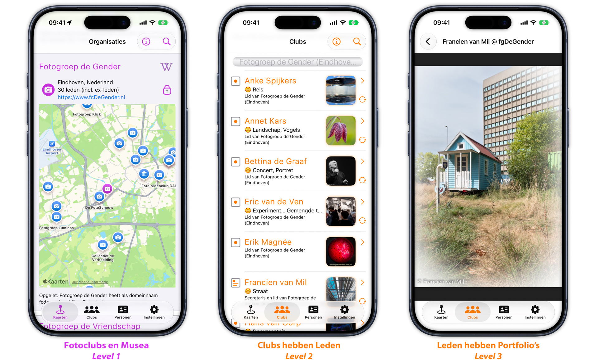
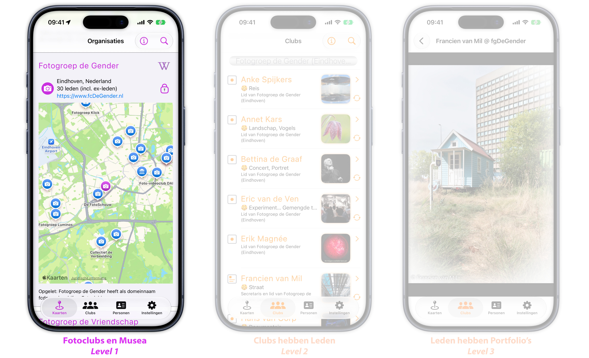
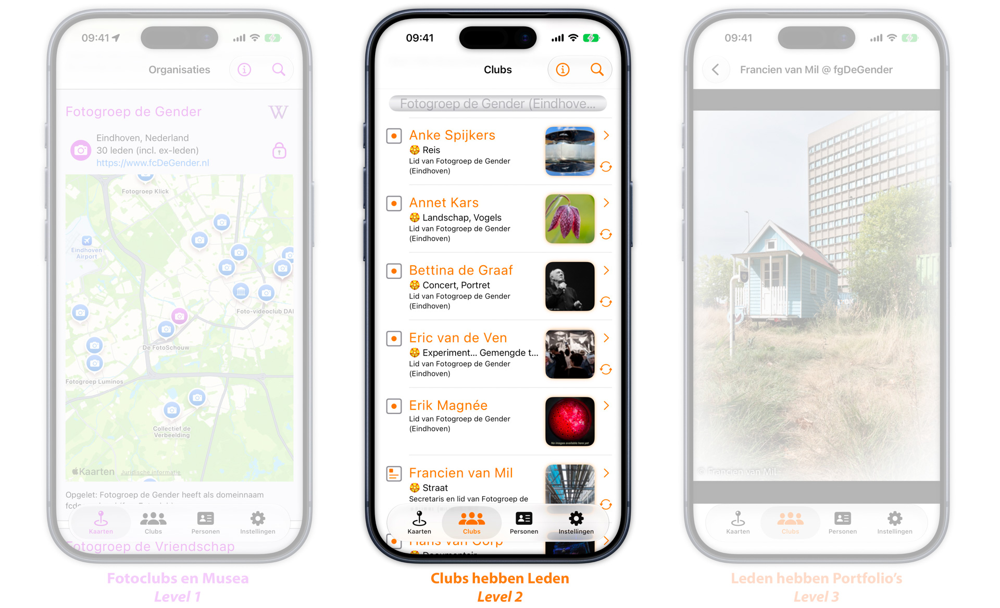
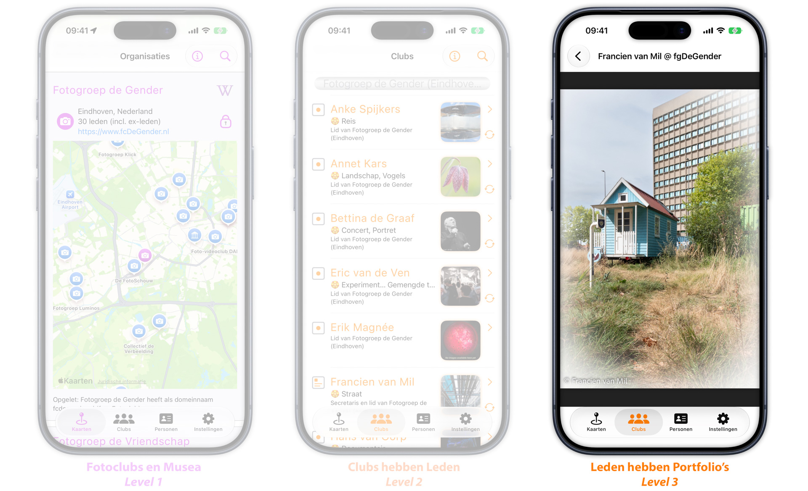
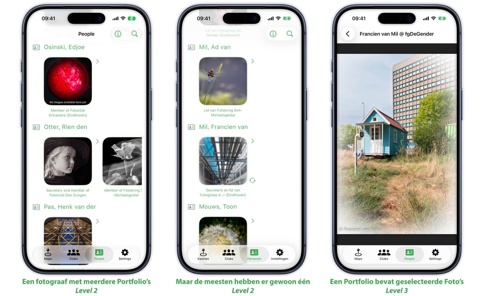
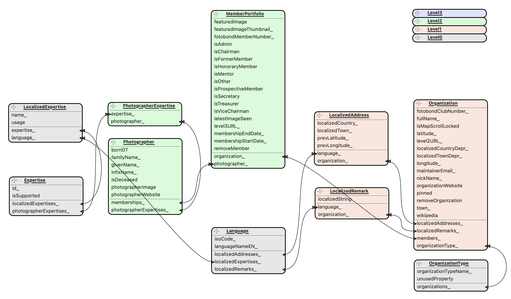

<div id="top"></div>

[🇬🇧 English version](README.md)

[![Version][stable-version]][version-url]
[![Contributors][contributors-shield]][contributors-url]
[![Forks][forks-shield]][forks-url]
[![Stargazers][stars-shield]][stars-url]
[![Issues][issues-shield]][issues-url]
[![Discussions][discussions-shield]][discussions-url]
[![MIT License][license-shield]][license-url]



<!-- INHOUDSOPGAVE -->
## Inhoudsopgave
<ul>
    <a href="#over-het-project">Over het project</a>
          <ul>
            <li><a href="#de-app">De app</a></li>
            <li><a href="#fotoclubs">Fotoclubs</a></li>
          </ul>
    </p>
    <a href="#de-schermen-van-de-gebruikersinterface">De schermen van de gebruikersinterface</a>
          <ul>
            <li><a href="#het-kaarten-scherm">Het Kaarten-scherm</a></li>
            <li><a href="#het-clubs-scherm">Het Clubs-scherm</a></li>
            <li><a href="#het-personen-scherm">Het Personen-scherm</a></li>
            <li><a href="#het-afbeeldingen-scherm">Het Afbeeldingen-scherm</a></li>
            <li><a href="#het-readme-scherm">Het Readme-scherm</a></li>
            <li><a href="#het-instellingen-scherm">Het Instellingen-scherm</a></li>
            <li><a href="#het-prelude-scherm">Het Prelude-scherm</a></li>
          </ul>
    </p>
    <details open><summary><a href="#functies">Functies</a></summary>
        <ul>
            <li><a href="#ondersteuning-voor-meerdere-clubs">Ondersteuning voor meerdere clubs</a></li>
            <li><a href="#websitegeneratie">Websitegeneratie</a></li>
            <li><a href="#doorzoekbare-lijsten">Doorzoekbare lijsten</a></li>
            <li><a href="#fotomusea">Fotomusea</a></li>
            <li><a href="#expertises-van-fotografen">Expertises van fotografen</a></li>
            <li><a href="#trek-omlaag-om-te-verversen">Trek omlaag om te verversen</a></li>
            <li><a href="#slim-scrollen">Slim scrollen</a></li>
        </ul>
    </details>
    <details open><summary><a href="#fotoclubs-toevoegen-aan-de-app">Fotoclubs toevoegen aan de app</a></summary>
        <ul>
            <li><a href="#levels">Levels</a></li>
            <li><a href="#levels-en-schermen">Levels en schermen</a></li>
            <li><a href="#level-0-expertises-en-talen">Level 0. Expertises en talen</a></li>
            <li><a href="#level-1-clubs-toevoegen">Level 1. Clubs toevoegen</a></li>
            <li><a href="#level-2-leden-toevoegen">Level 2. Leden toevoegen</a></li>
            <li><a href="#level-3-afbeeldingen-toevoegen">Level 3. Afbeeldingen toevoegen</a></li>
        </ul>
    </details>
    <details open><summary><a href="#installatie">Installatie</a></summary>
         <ul>
            <li><a href="#gemaakt-met">Gemaakt met</a></li>
            <li><a href="#de-repository-klonen">De repository klonen</a></li>
            <li><a href="#code-signing">Code signing</a></li>
            <li><a href="#de-app-updaten">De app updaten</a></li>
         </ul>
    </details>
    <a href="#bijdragen">Bijdragen</a>
           <ul>
                <li><a href="#bijdragen-van-ontwikkelaars">Bijdragen van ontwikkelaars</a></li>
                <li><a href="#overige-bijdragen">Overige bijdragen</a></li> 
           </ul>
    </p><details><summary><a href="#de-architectuur-van-de-app">De architectuur van de app</a></summary>
           <ul>
               <li><a href="#de-rol-van-de-database">De rol van de database</a></li>
               <li><a href="#het-datamodel">Het datamodel</a></li>
               <ul>
                     <li>Organization</li>
                     <li>Photographer</li>
                     <li>MemberPortfolio</li>
                     <li>OrganizationType</li>
                     <li>Language</li>
                     <li>LocalizedAddress</li>
                     <li>LocalizedRemark</li>
                     <li>Expertise</li>
                     <li>LocalizedExpertise</li>
                     <li>PhotographerExpertise</li>
               </ul>
               <li><a href="#hoe-data-wordt-geladen">Hoe data wordt geladen</a></li>
               <ul>
                    <li>De oude aanpak</li>
                    <li>De nieuwe aanpak</li>
                    <ul>
                        <li>Level 1: centrale lijst van fotoclubs</li>
                        <li>Level 2: lokale ledenlijsten per fotoclub</li>
                        <li>Level 3: lokale portfolio's per clublid</li>
                    </ul>
               </ul>
               <li><a href="#wanneer-data-wordt-geladen">Wanneer data wordt geladen</a></li>
               <ul>
                    <li>Achtergrondthreads</li>
                    <li>SwiftUI-viewupdates</li>
                    <li>Core Data-contexten</li>
                    <li>Vergelijking met SQL-transacties</li>
              </ul>
           </ul>
    </details>
    <details><summary><a href="#administratief">Administratief</a></summary>
        <ul>  
            <li><a href="#licentie">Licentie</a></li>
            <li><a href="#contact">Contact</a></li>
            <li><a href="#dankbetuigingen">Dankbetuigingen</a></li>
        </ul>
    </details>
</ul>

## Over het project

### De app

Deze iOS-app toont foto's die zijn gemaakt door leden van fotoclubs.
De app dient daarmee als een permanente online galerie met geselecteerd werk van deze fotografen.</p>

De app laat gebruikers beelden van meerdere clubs binnen één app bekijken.
Dat geeft een zekere uniformiteit en bespaart de gebruiker het opzoeken van de website van een club,
het uitzoeken waar de foto's op die site staan en hoe je door de portfolio's bladert.
   
Hiervoor haalt de app online lijsten op van fotoclubs, van clubleden en van hun geselecteerde foto's. 
Zo kunnen fotoclubs, clubleden en hun portfolio's worden toegevoegd en bijgewerkt zonder dat de software van de app hoeft te veranderen.
Bovendien kunnen de clubs zo hun eigen gegevens beheren.</p>

Verderop staat een <a href="#fotoclubs-toevoegen-aan-de-app">hoofdstuk</a> over hoe je de gegevens van een club toevoegt in 
3 aparte "`Levels`" (stappen).

### Fotoclubs

> De app toont geselecteerde beelden die zijn gemaakt door leden van fotoclubs.

Fotoclubs zijn daarmee het onderscheidende kenmerk van deze app.

Je kunt eerst een fotoclub opzoeken en daarna de leden ervan vinden in het `Clubs`-scherm. 
Of je zoekt juist eerst een fotograaf op en vindt daarna de bijbehorende fotoclub in het `Personen`-scherm.
In beide gevallen kun je, zodra je een combinatie van fotograaf en club hebt gekozen, het fotoportfolio van dat clublid bekijken.

<ul><details><summary>Details (klik om uit te vouwen)</summary></p>

Hier is een schematische weergave van het `Clubs`-scherm.
Dit scherm zet de fotoclub voorop en laat je vervolgens clubleden en hun werk selecteren:

* fotoclub _Clickers_ (gehost op `www.PhotoClubClickers.com`)
  * lid __Bill__
    * foto's van Bill als lid van de Clickers
  * lid __John__
    * foto's van John als lid van de Clickers

* fotoclub _Zoomers_ (gehost op `www.PhotoClubZoomers.com`)
  * lid __John__
    * foto's van John als lid van de Zoomers
  * lid __Sean__
    * foto's van Sean als lid van de Zoomers

<a/></p>

Een alternatieve navigatieroute loopt via het `Personen`-scherm.
Dit scherm zet de fotograaf voorop, zodat je een fotograaf ook kunt vinden als je de naam
van de club (of clubs) waarmee de fotograaf verbonden is niet kent:

* fotograaf __Bill__
  * fotoclub _Clickers_ (gehost op `www.PhotoClubClickers.com`)
      * foto's van Bill als lid van de Clickers

* fotograaf __John__
  * fotoclub _Clickers_ (gehost op `www.PhotoClubClickers.com`)
      * foto's van John als lid van de Clickers
  * fotoclub _Zoomers_ (gehost op `www.PhotoClubZoomers.com`)
      * foto's van John als lid van de Zoomers 

* fotograaf __Sean__
    * fotoclub _Zoomers_ (gehost op `www.PhotoClubZoomers.com`)
        * foto's van Sean als lid van de Zoomers
   
<a/></p>

Ter vergelijking: traditionele persoonlijke websites leggen de nadruk op de beelden van de fotograaf, zonder verwijzing naar clubs:
    
* website van __Bill__ (gehost op `www.BillIsAwesome.com`)
  * fotogalerie met portretten
    * portretfoto's van Bill
  * fotogalerie met landschappen
    * landschapsfoto's van Bill

* website van __John__ (gehost op `www.JohnIsAwesomeToo.com`)
  * fotogalerie met macrofoto's
    * macrofoto's van John
  * : 

### Implicaties
<ul><details>
<summary>Details (klik om uit te vouwen)</summary></p>

Als een fotograaf lid is (geweest) van *meerdere* fotoclubs, kan de app *meerdere* portfolio's (met onafhankelijke
inhoud) voor die fotograaf tonen - één per fotoclub. Dat kan betekenen dat de fotograaf op dit moment
lid is van _twee_ verschillende clubs. Maar het kan ook betekenen dat een fotograaf de ene club heeft verlaten en zich bij een andere club heeft aangesloten.
Of varianten van deze scenario's.</p>

> In alle gevallen groepeert het `portfolio`-concept de beelden zowel per fotograaf als per fotoclub. </p>

De app is dus niet bedoeld als vervanging van een persoonlijke website, maar kan wel links bevatten naar de persoonlijke website van een fotograaf.
Verder staat niets je in de weg om een online groep fotografievrienden te ondersteunen - ervan uitgaande
dat zij dit samen willen organiseren.

<ul><details>
<summary>Details (klik om uit te vouwen)</summary></p>

Je zou jezelf zelfs als eenpersoonsclub kunnen beschouwen en je beelden in één portfolio onder die club kunnen plaatsen.
Of je gebruikt het clubniveau om een paar individuele fotografen te groeperen (per regio of interessegebied), zolang de leden
van deze niet-club bereid zijn dit af te stemmen (bijvoorbeeld het bijhouden van de lijst van 
portfolio's=fotografen die dan lid zijn van een informele club).

<a/></p></ul>
</details></ul></details>

</ul>
<p align="right">(<a href="#top">naar boven</a>)</p>
 
## De schermen van de gebruikersinterface

De app heeft onderaan het scherm een tabknop met vier tabs: `Kaarten`, `Clubs`, `Personen` en `Instellingen`.
De overige schermen zijn van daaruit bereikbaar: 

- het `Afbeeldingen`-scherm opent wanneer je op een portfolio tikt,
- het `Readme`-scherm opent via de Info-knop (ⓘ) die op de meeste tabs beschikbaar is,
- en het `Prelude`-scherm verschijnt wanneer de app wordt gestart.</p>

Gebruik van de verschillende schermen in de gebruikersinterface:
<ul>

### Het `Kaarten`-scherm

Het `Kaarten`-scherm toont alle fotoclubs die bekend zijn in de app.
Elk item bestaat vooral uit een kaart die toont waar de club zich bevindt, en toont desgewenst jouw huidige locatie.
Een knop met een slotje bepaalt of de kaart interactief bediend kan worden (scrollen, zoomen, roteren, 3D).
Standaard zijn de kaarten "op slot". Die stand helpt bij het scrollen door de lijst van clubs, in plaats van het scrollen binnen een kaart.



<ul><details>
<summary>Details (klik om uit te vouwen)</summary></p>
    
Een _paarse_ speld op de kaart toont waar de geselecteerde club is gevestigd (bijvoorbeeld een school of gemeentelijk gebouw).
Een _blauwe_ speld toont de locatie van elke andere fotoclub die zich toevallig in het getoonde gebied bevindt.
Het scherm kan ook fotomusea tonen die in beeld zijn. Deze hebben andere markeringen dan de fotoclubs.
Op het `Instellingen`-scherm kan je aangeven of je musea en/of clubs wilt verbergen.
Er zijn ook instellingen om via kleur aan te geven of een Nederlandse club lid is van de Fotobond.

</details></ul>

### Het `Clubs`-scherm

Het `Clubs`-scherm toont alle fotoclubs die in de app zijn opgenomen.
Hier selecteer je eerst een fotoclub en daarna het portfolio van een van de leden.

De `Zoek`-knop filtert de ledenlijsten op de volledige naam van de fotograaf of op expertise-tags.
Naar links vegen verwijdert een item, maar dat is normaal gesproken niet nodig en is (nog) niet permanent.



### Het `Portfolio`-scherm

Het `Portfolio`-scherm toont één portfolio (van één fotograaf verbonden aan één club).
Je bereikt het door op een `portfolio` te tikken in het `Clubs`-scherm.
Er is een vergelijkbare route vanuit het `Personen`-scherm.
De titel bovenaan het `Portfolio`-scherm toont de geselecteerde fotograaf en de geselecteerde club:
"Francien van Mil van Fotogroep de Gender".



Er zijn verschillende manieren om deze portfolio's aan te maken. Deze manier is te zien bij Fotogroep de Gender
en gebruikt een Lightroom plug-in (`Juicebox Pro`) om webpagina's te maken vanuit LR collecties.

Op de voorkeursmanier worden beelden automatisch getoond in volgorde van heden naar verleden op basis van de _opnamedatum_ van het beeld.
Soms (afhankelijk van plug-in instellingen) krijg je het jaartal onder de foto's te zien.
Je kunt daar naar links of rechts _vegen_ om handmatig terug of vooruit te bladeren door het portfolio.
Er is ook een _autoplay_-stand voor het automatische doorlopen van de beelden ("diavoorstelling").

### Het `Personen`-scherm



De `Personen`-tab toont alle fotografen die voorkomen in de app.
De banden van deze fotograaf met clubs (of persoonlijke lidmaatschap van de Fotobond) worden als vierkante foto's on de naam getoond.
De `Personen`-tab ondersteunt dus een Persoon>Club navigatievolgorde. De verwante `Clubs`-tab werkt daarentegen van Club>Persoon.

Per Portfolio (Persoon/Club combinatie) kan je navigeren naar de een scherm met alle foto's binnen de Portfolio.
De `Zoek`-knop filtert op de namen van fotografen. Filteren op clubnaam of expertise wordt nog niet ondersteund.

### Het `Readme`-scherm

Het `Readme`-scherm (in de app getiteld "Over deze app") bevat achtergrondinformatie over de app en uitleg over het gebruik ervan.
Het opent als een sheet via de Info-knop (ⓘ) in de werkknop van de tabs `Personen`, `Clubs` en `Kaarten`.


### Het `Instellingen`-scherm

In het `Instellingen`-scherm stel je in welke soorten portfolio's je wilt opnemen in het
`Clubs`-scherm. Je kunt bijvoorbeeld kiezen of oud-leden worden getoond.
Het `Instellingen`-scherm zou waarschijnlijk ook het `Personen`-scherm moeten filteren - maar dat doet het nog niet.


### Het `Prelude`-scherm

Het `Prelude`-scherm toont een openingsanimatie.
Tikken buiten de centrale afbeelding sluit de Prelude af en toont de hoofdinterface van de app (beginnend op de `Clubs`-tab).


<ul><details>
<summary>Details over het Prelude-scherm (klik om uit te vouwen)</summary></p>

Wanneer de app start, toont deze een grote versie van het app-icoon. 
Tikken op het icoon verandert het in een interactieve afbeelding die illustreert hoe de meeste digitale camera's kleur waarnemen.</p>

> Dit werkt met een [Bayer-kleurenfilter](https://en.wikipedia.org/wiki/Bayer_filter)
> dat het licht filtert dat elke fotocel of pixel bereikt.
> In een 24-megapixelcamera bestaat de beeldsensor doorgaans uit een raster van 4000 bij 6000 fotocellen.
> Elke fotocel op de chip zelf is niet kleurgevoelig. Maar door een minuscuul rood, groen of blauw kleurfilter op
> de chip te plaatsen, wordt de cel het gevoeligst voor één specifiek kleurbereik. In de meeste camera's wordt dus per pixel maar
> één kleur gemeten: de twee ontbrekende kleurkanalen voor die pixel worden geschat met behulp van kleurinformatie van omliggende pixels.

Tikken *binnen* de afbeelding laat je naar hartenlust in- en uitzoomen.
Tikken *buiten* de afbeelding sluit de Prelude af en toont de hoofdinterface van de app.

Je ziet de Prelude-animatie opnieuw nadat je de app hebt afgesloten en opnieuw hebt gestart.

Waarom zo'n fraai openingsscherm? Het was deels een leuke uitdaging om te maken (het draait daadwerkelijk
op de GPU-kernen van je apparaat). Maar het helpt ook het logo van de app te verklaren: het Bayer-filter bestaat inderdaad uit een raster van herhaalde
rode, blauwe en _twee_ groene pixels.
</details>
    
</ul></ul>
<p align="right">(<a href="#top">naar boven</a>)</p>
 
## Functies
<ul>

### Ondersteuning voor meerdere clubs

Versie 1 van de app ondersteunde alleen Fotogroep Waalre.
Versie 2 voegde ondersteuning voor meerdere fotoclubs toe. Dit betekent:

- alle clubs in het systeem worden technisch op dezelfde manier behandeld (al kan de ene club meer gegevens hebben aangeleverd dan de andere)
- gebruikers kunnen alle ondersteunde clubs op de kaarten vinden
- een fotograaf wordt indien van toepassing getoond met meerdere clubs (bijvoorbeeld een voormalige club en de huidige club)
- de app wordt stapsgewijs voorbereid op grotere hoeveelheden gegevens (data wordt verdeeld over sites)
- de app begint het mogelijk te maken dat clubs hun eigen gegevens beheren (data "binnen" een club wordt door de club beheerd)

### Websitegeneratie

Er bestaat een zusterapp [Photo Club Hub HTML](https://github.com/vdhamer/Photo-Club-Hub-HTML) die
dezelfde invoergegevens als deze app gebruikt om (statische) HTML-webpagina's te genereren. De zusterapp genereert
statische webpagina's _per club_ die de leden van elke club tonen, met links naar hun portfolio's.

De webpagina's per club zijn samen gelijkwaardig aan de portfoliopagina in de iOS-app.
De individuele clubpagina's kunnen eenvoudig worden geïntegreerd in bestaande websites (bijvoorbeeld WordPress) die door
de clubs zelf worden beheerd.

Behalve dat websites zo actueel blijven met de beschikbare Photo Club Hub-gegevens, biedt de HTML-versie een alternatief
voor "de rest van ons" zonder iPhone of iPad.
De HTML-versie dekt ook de gevallen waarin iemand de informatie of foto's op een laptop of desktopcomputer wil bekijken.

### Doorzoekbare lijsten

De drie schermen met lange lijsten (`Clubs`, `Kaarten`, `Personen`) hebben elk een zoekknop
waarin je kunt invoeren wat je zoekt. Dit beperkt de lijst tot items die aan dat filtercriterium voldoen.</p>

<details><summary>Details over de zoekknop (klik om uit te vouwen)</summary></p>

De plaats van de zoekknop verschilt per apparaat: iPads tonen deze bovenaan het scherm,
nieuwere iPhones tonen deze onderaan het scherm (net boven de tabknop),
en oudere iPhones tonen deze bovenaan de lijst (scroll snel omhoog tot je bovenaan bent).

De tekst die je in de zoekknop typt, wordt vergeleken met sleutelvelden van de records in de lijst.

- In het `Clubs`-scherm filtert een zoekopdracht op de namen van fotografen en op hun expertises.
  Zoeken op `Jan` kan `Jan Stege`, `Ariejan van Twisk` en `Jos Jansen` opleveren.
  Als je op clubnamen wilt zoeken, ga dan naar het `Kaarten`-scherm.
- In het `Kaarten`-scherm proberen zoekopdrachten te matchen op organisatienamen en plaatsen.
  Zoeken op `Ber` kan `FFC Shot71 (Berlicum)` en `Museum für Fotografie (Berlin)` en `The Victoria & Albert Museum (London)` opleveren.
  Merk op dat de plaats de locatie is zoals opgegeven in het bestand `root.level1.json` en _niet_ de vertaalde versie, die kan afwijken.
- In het `Personen`-scherm proberen zoekopdrachten te matchen op de volledige naam van de fotograaf.
  Zoeken op `Jan` kan `Jan Stege`, `Ariejan van Twisk` en `Jos Jansen` opleveren.

Ontwerpdetail: het filteren via de zoekknop gebeurt in de gebruikersinterface van de app en niet door de CoreData-database.
</details>

### Expertises van fotografen

</p>Fotografen kunnen worden gekoppeld aan expertises die beschrijven om welk soort fotografie zij vooral bekendstaan.
Voorbeelden: "Zwart-wit" of "Landschap". Omdat deze expertises gebruikt kunnen worden om te zoeken naar fotografen met vergelijkbare
interesses, zijn de expertises gestandaardiseerd (gebruik bijvoorbeeld consequent "Black & White" in plaats van een mix met "B&W" of "Black and White"). 
</p>

<details><summary>Details over de standaardisatie van expertises (klik om uit te vouwen)</summary></p>

Standaardisatie helpt ook bij het weergeven van de teksten in meerdere talen. 
De vertalingen worden gedefinieerd in één bestand, `Level 0` genaamd. 
Dit betekent dat als de Sierra Club hun lid Ansel Adams koppelt aan "Black & White",
ze automatisch vertalingen van "Black & White" in bepaalde talen krijgen:
staat de app op Nederlands, dan ziet de gebruiker "Zwart-wit" in plaats van "Black & White".

Informatie over hoe je expertises per fotograaf definieert en hoe je gestandaardiseerde expertises definieert, vind je in
de uitleg over respectievelijk het toevoegen van `Level 2`-data en het onderhouden van `Level 0`-data.
</details>

### Fotomusea

</p>De kaarten die de locaties van fotoclubs tonen, tonen ook de locaties van geselecteerde fotomusea.</p>

<details><summary>Details over musea (klik om uit te vouwen)</summary></p>

Een fotomuseum is geen fotoclub en wordt op de kaarten weergegeven met een eigen markering.
Technisch gezien staat de app niet toe dat musea "leden" hebben die beelden met het museum delen.</p>

Beschouw het tonen van musea als een bonus die sommige gebruikers zal interesseren.
Je bent welkom om een favoriet fotomuseum toe te voegen via een GitHub-pull-request. Daarvoor hoef je alleen een JSON-bestand uit te breiden.
Het bestandsformaat is hieronder gedocumenteerd bij [Hoe data wordt geladen](#hoe-data-wordt-geladen).
</details>

### Trek omlaag om te verversen

De bovenkant van de schermen `Clubs`, `Kaarten` en `Personen`
kan omlaag worden getrokken om alle app-gegevens opnieuw op te halen.
Verversen is meestal niet nodig, maar kan worden gebruikt om databaserecords te verwijderen
die eerder zijn gedownload maar niet meer in gebruik zijn.
De functie is een snel alternatief voor het verwijderen en opnieuw installeren van de app:
de database wordt leeggemaakt en de ontbrekende gegevens worden meteen opnieuw gedownload.
</p>

<details><summary>Details over datasynchronisatie (klik om uit te vouwen)</summary></p>
Telkens wanneer de app wordt gestart, haalt deze verse informatie op van online servers.
Het gebruik van online data zorgt ervoor dat de app actueel blijft ten opzichte van de online lijsten
met clubs en musea (`Level 1`), clubleden (`Level 2`) en portfoliofoto's (`Level 3`).</p>

Deze verse online data wordt samengevoegd met de gegevens op het apparaat (`CoreData`): een blijvende kopie van de data
die tijdens eerdere app-sessies is ontvangen. Dit samenvoegen werkt dus de database op het apparaat bij.  
De gebruikersinterface van de app wordt direct bijgewerkt zodra de database wordt bijgewerkt.</p>

Er kan een probleem ontstaan wanneer een club (of museum of lid) wordt verwijderd uit de online versie van de informatie.
Stel bijvoorbeeld dat de identificerende naam of plaats van de club is aangepast in de `Level 1`-lijst.
Dat betekent dat de online lijst nu een "andere" club bevat: een met een andere combinatie van identificerende naam en plaats.
Helaas kan de app niet weten dat deze "nieuwe" club eigenlijk dezelfde is als de club die schijnbaar verdween.
Vanuit het perspectief van de app zijn het verdwijnen van de oorspronkelijke club en het verschijnen van een nieuwe club dus twee losse gebeurtenissen.
De nieuwe club hoeft alleen maar geladen te worden. Maar de app detecteert het verdwijnen van de oorspronkelijke club momenteel niet.</p>

Er is een GitHub-ticket om in de toekomst "verdwenen" of hernoemde clubs automatisch te detecteren. </p>

Een tijdelijke workaround is de functie _trek omlaag om te verversen_: 
die verwijdert simpelweg de volledige inhoud van de database en laadt daarna alles opnieuw.
Dit synchroniseert de interne (CoreData-)database van het apparaat volledig met de online data.
Als alternatief kan de gebruiker de app verwijderen en opnieuw installeren.</p>

Een andere toepassing van _trek omlaag om te verversen_ is het forceren van het opnieuw laden van online data wanneer je weet dat die net is gewijzigd.
</details>

### Slim scrollen

De schermen _Kaarten_ en _Personen_ proberen te voorkomen dat gedeeltelijke kaarten of gedeeltelijke fotografeninfo wordt getoond.
</p>

<details><summary>Details over slim scrollen</summary></p>

Apple introduceerde `ScrollTargetBehavior` voor SwiftUI's `ScrollViews` in iOS 17.
Hiermee kan de app bepalen waar op de pagina een scrollbeweging tot stilstand komt,
zodat wordt voorkomen dat een lijstsectie wordt getoond waarvan een deel van de bovenste informatie niet zichtbaar is.
</p>
    
In iOS 17 ging deze functie ervan uit dat het scherm bestaat uit een lijst van items van gelijke hoogte.
Omdat iOS 18 blijkbaar overweg kan met lijstitems van variabele hoogte, 
ziet de slim scrollende inhoud van de app er onder iOS 18 iets beter uit.
</p>

Helaas biedt het _Clubs_-scherm deze slimme scrollfunctie niet, 
omdat het intern gebruikmaakt van een "gesegmenteerde List-view" in plaats van `ScrollView`.
We moesten dus kiezen tussen het verwijderen van de segmentatie of het niet aanbieden van slim scrollen in het `Clubs`-scherm.
</details>
</ul>
<p align="right">(<a href="#top">naar boven</a>)</p>

## Fotoclubs toevoegen aan de app

> De app is zo ontworpen dat de benodigde informatie over fotoclubs wordt aangeleverd
en onderhouden door de clubs zelf. 

Dit is belangrijk omdat de app zo **veel clubs kan ondersteunen**.
Maar het is ook nodig om clubs **controle** te geven over hun gegevens:
een club weet zelf het beste wat er over de club te melden is, wie de huidige leden zijn,
wie de bestuursleden zijn, en welke beelden de leden in hun portfolio's willen.
<ul>
    
### Levels

De app onderscheidt 4 hiërarchische lagen van informatie:

- `Level 0` bestaat uit referentiedata (zoals een lijst van `talen`). Beschouw dit level als een implementatiedetail.
- `Level 1` bestaat uit de clubnamen en geografische locaties.
- `Level 2` bevat de leden per club.
- `Level 3` verwijst naar portfolio's per clublid.</p>

We noemen deze informatielagen `Levels` omdat je - net als in een game - een level pas kunt bereiken nadat je alle lagere levels hebt voltooid.
En - opnieuw net als in een game - het bereiken van een bepaald level "ontgrendelt" extra app-functionaliteit voor die club.

Een club mag er zo lang over doen als ze wil (dagen, weken, maanden) voordat ze naar het volgende level gaat.
Dit betekent dat een app-gebruiker clubs op verschillende `Levels` in de app kan aantreffen.
Voor de gebruiker betekent dat simpelweg dat sommige clubs meer informatie hebben gedeeld dan andere. 

Musea worden vrijwel op dezelfde manier behandeld als fotoclubs, maar voor musea is alleen `Level 1` van toepassing.
Je vindt dus geen leden van een museum of portfolio's die aan die leden zijn gekoppeld.

Intern ondersteunt de app eigenlijk nog één extra datalaag:

- `Level 0` bevat enkele basisconfiguratiegegevens.</p>

Gebruikers en clubs hoeven zich normaal gesproken niet om deze laag te bekommeren. `Level 0`-data wordt gedeeld tussen clubs en dus centraal beheerd. 
De belangrijkste inhoud is een lijst van ondersteunde expertises voor fotografen, plus vertalingen van deze expertises in ondersteunde talen.

### Levels en schermen


Wanneer een club op `Level 1` staat, verschijnt deze als markering op de kaarten (schermafbeelding links).
De app kent immers de naam van de club en de breedte-/lengtegraad van de locatie.

Voor clubs op `Level 2` kent de app ook de namen en optionele rollen van clubleden.
Zoals de middelste schermafbeelding laat zien, worden de club en haar leden nu getoond op de schermen `Clubs` en `Personen`.
Clubs met nul leden (voor zover bekend bij de app) worden op geen van beide schermen getoond.

Voor clubs op `Level 3` kent de app de beeldportfolio's van clubleden (schermafbeelding rechts), 
en kunnen app-gebruikers door de foto's van leden bladeren.
Technisch gezien hoeven niet alle clubleden tegelijk `Level 3` te bereiken: je kunt eerst een testportfolio voor
één lid toevoegen, daarna uitbreiden naar alle leden, en later desgewenst recente oud-leden toevoegen. 
Bij het openen van een portfolio van een clublid zonder beschikbaar portfolio wordt een rode ingebouwde plaatsvervangende afbeelding getoond.

### Level 0. Expertises en talen

`Level 0` bevat ondersteunde expertises, ondersteunde talen en de vertalingen van expertises in die talen.
Je kunt het lezen over `Level 0` bij een eerste kennismaking gerust overslaan: het beschrijft alleen data die nodig is voor een optionele functie.

<ul><details><Summary>Level 0-voorbeeld (klik om uit te vouwen)</Summary>

``` json
{
    "expertises": [
        {
            "idString": "Landscape",
            "name": [
                { "language": "EN", "localizedString": "Landscape" },
                { "language": "NL", "localizedString": "Landschap" },
                { "language": "AR", "localizedString": "منظر جمالي" }
            ]
        },
        {
            "idString": "Black & White",
            "name": [
                { "language": "EN", "localizedString": "Black & White" },
                { "language": "NL", "localizedString": "Zwart-wit" }
            ],
            "optional": {
                "usage": [
                    { "language": "EN", "localizedString": "Grayscale, sepia or other monochrome images" }
                ]
            }
        }
    ],
    "languages": [
        {
            "isoCode": "EN",
            "languageNameEN": "English"
        },
        {
            "isoCode": "NL",
            "languageNameEN": "Dutch"
        },
        {
            "isoCode": "AR",
            "languageNameEN": "Arabic"
        }
    ]
}
```
</details></ul>

<ul><details><Summary>Verplichte Level 0-velden (klik om uit te vouwen)</Summary></p>

- `expertises` bevat de expertises die aan een of meer `photographers` kunnen worden gekoppeld om hun belangrijkste genres te beschrijven.
Expertises gelden voor de fotograaf in het algemeen, en niet voor het lidmaatschap van de fotograaf bij een bepaalde club.
Als meerdere clubs verschillende expertises aan dezelfde fotograaf toekennen, worden de lijsten in de app automatisch samengevoegd ("union"). 
    - `idString` dient alleen om een expertise te identificeren. Gebruik bij voorkeur de Engelse versie van de expertise - maar een tekst als "Expertise #123" werkt ook.
    - `name` is een lijst van vertalingen van de expertise in een of meer talen.
        - `language` bevat de isoCode (meestal 2 letters) van de taal.
Gebruik de 3-lettercode alleen voor ongebruikelijke talen waarvoor geen 2-lettercode bestaat.
De codes moeten overeenkomen met de standaard [ISO 639-lijst](https://www.loc.gov/standards/iso639-2/php/English_list.php).
Het is belangrijk de juiste waarden te gebruiken, omdat `isoCode` wordt vergeleken met de voorkeurscodes die iOS aanlevert.
Voorbeeld: "DE" is "Duits".
        - `localizedString` bevat de vertaling van de expertise in de aangegeven taal.
Lever indien mogelijk vertalingen aan voor de talen die de app ondersteunt (momenteel EN en NL).
Extra vertalingen zijn prima, en worden gebruikt waar dat van toepassing is.
- `languages` bevat de taalcodes die worden gebruikt voor gelokaliseerde `expertises` van fotografen en `remarks` over `organizations`.
    - `isoCode` is de 2-letterige (ISO 639-1) of 3-letterige (ISO 639-2) taalcode van de taal. Gebruik de 2-lettercodes waar beschikbaar.
    - `languageNameEN` is de naam van de taal in het Engels. Voorbeeld: "Chinese". Zo kun je zien dat ZH voor Chinees staat.
</details></ul>

<ul><details><Summary>Optionele Level 0-velden (klik om uit te vouwen)</Summary></p>

- `usage` (binnen een `expertise`) is een beschrijving van het beoogde gebruik van de expertise.
De optionele `usage`-tekst kan in meerdere talen worden gedefinieerd (bij voorkeur minstens in EN en NL).
</details></ul>

### Level 1. Clubs toevoegen

Voor het toevoegen van fotoclubs (of musea) op `Level 1` zijn een naam, locatie en enkele optionele URL's nodig. 
Hiermee kan de app de items tonen in het `Kaarten`-scherm en ze weergeven met locatiemarkeringen op de kaarten.

`Level 1`-data wordt technisch opgeslagen in één centraal gehost 
[bestand](https://github.com/vdhamer/Photo-Club-Hub/blob/main/JSON/root.level1.json)
genaamd `root.level1.json`.
Telkens wanneer de app wordt gestart, werkt deze verouderde data op het apparaat bij door dit centrale online bestand te lezen.

Als je ons de `Level 1`-informatie van een club stuurt, voegen we die graag voor je toe aan dit centrale `root.level1.json`-bestand.
Waar mogelijk zien we de wijziging (en toekomstige updates) echter liever als GitHub-_pull-request_.
Dat beperkt het werk dat nodig is om veel updates te verwerken, en verkleint de kans op administratieve fouten.

Hetzelfde geldt als je een fotomuseum wilt toevoegen aan het centrale `root.level1.json`-bestand.

<ul><details><Summary>Level 1-voorbeeld (klik om uit te vouwen)</Summary></p>

Hier is een voorbeeld van het formaat van het `root.level1.json`-bestand met slechts één fotoclub en één fotomuseum.

``` json
{
    "clubs": [
        {
            "idPlus": {
                "town": "Eindhoven",
                "fullName": "Fotogroep de Gender",
                "nickName": "fgDeGender"
            },
            "coordinates": {
                "latitude": 51.42398,
                "longitude": 5.45010
            },
            "optional": {
                "website": "https://www.fcdegender.nl",
                "level2URL": "https://www.fcdegender.nl/fgDeGender.level2.json",
                "remark": [
                    { "language": "NL", "value": "Opgelet: Fotogroep de Gender gebruikt als domeinnaam nog altijd fcdegender.nl (van Fotoclub)." }
                ],
                "maintainerEmail": "admin@fcdegender.nl",
                "nlSpecific": {
                    "fotobondNumber": 1620
                }
            }
        }
    ],
    "museums": [
        {
            "idPlus": {
                "town": "New York",
                "fullName": "Fotografiska New York",
                "nickName": "Fotografiska NYC"
            },
            "coordinates": {
                "latitude": 40.739278,
                "longitude": -73.986722
            },
            "optional": {
                "website": "https://www.fotografiska.com/nyc/",
                "wikipedia": "https://en.wikipedia.org/wiki/Fotografiska_New_York",
                "remark": [
                    { "language": "EN", "value": "Fotografiska New York is a branch of the Swedish Fotografiska museum." },
                    { "language": "NL", "value": "Fotografiska New York is een dependance van het Fotografiska museum in Stockholm." }
                ]
            }
        }
    ]
}
```

Het echte `root.level1.json`-bestand bevat veel club- en museumrecords binnen hun respectievelijke secties (afgebakend met `[{},{},{}}]`-syntaxis).
Let op de komma's tussen de array-elementen - het JSON-dataformaat is erg kieskeurig over ontbrekende of extra komma's, 
omdat JSON-bestanden vaak door software worden gegenereerd in plaats van met de hand.
Je kunt de basissyntaxis van JSON-bestanden overigens controleren met online JSON-validators zoals
[JSONLint](https://jsonlint.com).
</details></ul>

<ul><details><Summary>Verplichte Level 1-velden (klik om uit te vouwen)</Summary></p>

- `level1Header` bevat informatie over het Level 1-bestand zelf.
    - Technisch gezien kunnen alle velden binnen de `level1Header` worden weggelaten. Maar het is een goed idee om `level1URL` en `maintainerEmail` op te nemen. Als `level1URLIncludes` een lege array bevat (zie hieronder), kan het veld `level1URLIncludes` worden weggelaten of een lege lijst bevatten.
- `level1URL` bevat de naam en locatie van het masterexemplaar van dit Level 1-bestand.
    - Hoewel het veld momenteel niet door de software wordt gelezen, dient het als identificatie bij het oplossen van problemen.
- `maintainerEmail` is de contactpersoon bij een technisch probleem met de inhoud van dit bestand. 
- `level1URLIncludes` bevat een lijst van Level 1-bestanden die automatisch door de software worden geladen telkens wanneer dit Level 1-bestand wordt geladen.
    - De lijst mag leeg zijn als dit Level 1-bestand een bescheiden aantal clubs bevat, maar als de lijst logischerwijs tientallen of honderden clubs bevat, is het beter de lijst op te splitsen in 2 of meer kleinere include-bestanden.
    - Een Level 1-bestand dat wordt "geïnclude" kan zelf ook weer eigen include-bestanden bevatten. Er is geen limiet aan hoe diep include-bestanden genest kunnen worden, maar er is een veiligheidsmechanisme dat automatisch beschermt tegen onbedoelde oneindige lussen.
    - `level1URLIncludes` geeft de eigenaar van een Level 1-bestand de bevoegdheid om de namen en reikwijdte van de eigen include-bestanden te bepalen (als die nodig zijn).
    - Houd de bestandsnaam wereldwijd uniek, zodat een bestand in de toekomst naar een andere locatie kan worden verplaatst. Maar gebruik de bestandsnaam vooral om de include-hiërarchie weer te geven. Voorbeeld: `clubsNL` bevat clubs in Nederland. We hebben besloten aan te sluiten bij de manier waarop de fotoclubs in Nederland in regio's zijn georganiseerd: `clubsNL01` tot en met `clubsNL17`. Een eventueel `clubsUS`-bestand kan er daarentegen voor kiezen include-bestanden te hebben die naar staten zijn vernoemd, zoals `clubsUSca`. En de eigenaar van `clubsUSca` mag zo nodig een volgende decompositielaag voor Californië definiëren.
- `clubs` en `museums` zijn vereist om fotoclubs van fotomusea te onderscheiden.
  - Syntactisch kan elk van beide worden weggelaten, maar dan heb je geen fotoclubs of musea in de app.
    - Bij het laden in de interne database van de app bepalen `clubs` en `museums` het `OrganizationType` (`club` of `museum`) van elk `Organization`-object. Dit wordt onder andere gebruikt om te bepalen welk type markering op een kaart moet worden getoond.
- `town` kan een stad zijn (London) of een kleinere plaats (Land's End)
  - `town` is _niet_ direct zichtbaar in de gebruikersinterface, ook al lijkt dat misschien zo. De gebruikersinterface toont een taalgelokaliseerde naam die wordt gegenereerd op basis van de `coordinates`. Deze zogenoemde `localizedTown` kan dezelfde tekst bevatten als `town`, of een vertaling van `town` zijn, of zelfs een grotere of kleinere bestuurlijke eenheid aanduiden. Het `town`-veld in het bestand dient om een unieke ID voor een club of museum te garanderen. Zo zou `Fotoclub Lucifer` in `Vessem` als niet-verwant worden beschouwd aan een `Fotoclub Lucifer` in `Eersel`. Het `town`-veld dient ook ter documentatie van het record in het `root.level1.json`-bestand: het is duidelijker om te zeggen "Victoria and Albert Museum (London)" dan alleen "Victoria and Albert Museum", waarbij jij de locatie via de `coordinates` zou moeten achterhalen.
    - Op vergelijkbare wijze kan de gebruikersinterface een berekende `localizedCountry`-naam tonen die automatisch wordt gegenereerd op basis van de opgegeven `coordinates`. De Level 1-data heeft dus geen `country`-attribuut nodig en bevat dat ook niet. Dat is handig, omdat landnamen vaak in lokale talen worden vertaald (`Italia`, `Italy`, `İtalya`, enz.).
- `town` en `fullName` identificeren samen een club of museum.
  - Het is dus mogelijk om twee clubs met dezelfde naam in verschillende plaatsen te hebben. Twee aparte clubs of musea met een identieke naam in dezelfde plaats zou verwarrend zijn, en zou door de app als één entiteit worden behandeld totdat de data over de oorspronkelijke `town`/`fullName`-combinatie uit de database op het apparaat is verwijderd. Het verwijderen van verouderde `Organization`-records gebeurt helaas nog niet automatisch.
  - Probeer geen van beide teksten te wijzigen. Omdat de app de nieuwe ID niet koppelt aan de oorspronkelijke ID, leidt een wijziging ertoe dat de app twee verschillende clubs of musea toont.
- `nickName` is een korte versie van `fullName` die wordt getoond in krappe ruimtes zoals op kaarten. Het mag elke tekst zijn, maar houd het kort.
- `coordinates` wordt gebruikt om de club op de kaart te tekenen en om gelokaliseerde versies van de namen van plaatsen en landen te [genereren](http://www.vdhamer.com/reversegeocoding-for-localizing-towns-and-countries/).
- `latitude` moet in het bereik [-90.0, +90.0] liggen, waarbij negatieve waarden worden gebruikt voor het zuidelijk halfrond (bijvoorbeeld Australië).
- `longitude` moet in het bereik [-180.0, +180.0] liggen, waarbij negatieve waarden worden gebruikt voor het westelijk halfrond (bijvoorbeeld de VS).</p>
</details></ul>

<ul><details><Summary>Optionele Level 1-velden (klik om uit te vouwen)</Summary></p>

- `website` bevat een URL naar de algemene website van de club. Deze kan door de app in een apart browservenster worden geopend.
- `level2URL` (alleen voor clubs) bevat het adres van de `Level 2`-ledenlijst. Het wordt nog niet gebruikt (mei 2026).
- `wikipedia` bevat een URL naar een Wikipedia-pagina van een museum. Het _zou_ voor fotoclubs gebruikt kunnen worden - maar Wikipedia-pagina's over fotoclubs bestaan waarschijnlijk niet (en komen er waarschijnlijk ook niet).
- `remark` bevat een korte notitie met iets vermeldenswaardigs over de club of het museum. De `remark` bevat een array van alternatieve teksten in meerdere talen. De app kiest op basis van de taalinstelling van het apparaat welke van de aangeleverde talen wordt getoond.
  - `language` is de twee- of drieletterige [ISO 639](https://en.wikipedia.org/wiki/List_of_ISO_639_language_codes)-code van een taal. `EN` is Engels, `FI` is Fins.
      - Als de voorkeurstaal van het apparaat met geen van de aangeleverde talen overeenkomt, valt de app terug op EN, indien beschikbaar. Als EN niet beschikbaar is, kiest de app een van de beschikbare talen.
  - `value` is de tekst die voor die specifieke opmerking in die taal wordt getoond.
- `nlSpecific` is een container voor velden die alleen relevant zijn voor clubs in Nederland.
  - `fotobondNumber` is een ID-nummer dat wordt toegekend door de Fotobond (de Nederlandse federatie van fotoclubs).
  - Er was ook een `kvkNumber` (Kamer van Koophandel), maar dat is verwijderd omdat het de moeite niet waard was.
</details></ul></p>

### Level 2. Leden toevoegen

`Level 2`-ondersteuning vereist het aanleveren van een ledenlijst als bestand per club.
De `Level 2`-data van een club verschijnt in het `Clubs`-scherm als een ledenlijst per club.
Elk `Level 2`-JSON-bestand bevat de huidige (en optioneel voormalige) leden van één club.
Per lid wordt een URL opgeslagen die verwijst naar het `Level 3`-bestand (portfolio per lid).
`Level 2`-lijsten bevatten ook de URL van een afbeelding die als miniatuur voor dat lid wordt gebruikt.
</p>

_Fotogroep de Gender_ en _Fotogroep Waalre_ in Nederland hebben `.level2.json`-bestanden met ledendata.
</p>

<ul><details><Summary>Opslag van Level 2-data (klik om uit te vouwen)</Summary>
</p>

Een `Level 2`-bestand moet in een JSON-formaat staan, zodat de app de data kan interpreteren.
Je kunt de basissyntaxis van JSON-bestanden controleren met online JSON-validators zoals
[JSONLint](https://jsonlint.com).
</p>

Een `Level 2`-bestand kan overal online staan, maar staat standaard op de bestaande website van een club.
Je kunt het bijvoorbeeld opslaan binnen een bestaande _WordPress_-site met behulp van
de ingebouwde functies van _WordPress_ voor het uploaden van bestanden (`media` of `bibliotheek` genoemd).
</p>

De bestanden worden na het opstarten van de app op de achtergrond gedownload via een URL-adres uit het centrale `Level 1`-bestand.
</p>
    
De `Level 2`-data wordt bij het opstarten van de app in de CoreData-database van de app geladen, zodat de data al getoond kan worden voordat de
data is gedownload en de databaseinhoud is bijgewerkt.
</p>

Zodra er in de toekomst honderden of meer `Level 2`-bestanden beschikbaar zijn, zal de app selectief moeten worden in
welke clubs vooraf worden geladen en hoe vaak de `Level 2`-data wordt ververst.
</p>

</details></ul>

<ul><details><Summary>Level 2-voorbeeld (klik om uit te vouwen)</Summary></p>

Hier is een voorbeeld van het formaat van een `Level 2`-lijst voor een fotoclub. Dit voorbeeld bevat slechts één lid:

``` json
{
    "club":
        {
            "idPlus": {
                "town": "Eindhoven",
                "fullName": "Fotogroep de Gender",
                "nickName": "fgDeGender"
            },
            "coordinates": {
                "latitude": 51.42398,
                "longitude": 5.45010
            },
            "optional": {
                "website": "https://www.fcdegender.nl",
                "wikipedia": "https://nl.wikipedia.org/wiki/Gender_(beek)",
                "level2URL": "https://www.example.com/deGender.level2.json",
                "remark": [
                    {
                        "language": "EN",
                        "value": "Note that Fotogroep de Gender is abbreviated fcdegender.nl for historical reasons."
                    }
                ],
                "maintainerEmail": "admin@fcdegender.nl",
                "nlSpecific": {
                    "fotobondNumber": 1620
                }
            }
        },
    "members": [
        {
            "name": {
                "givenName": "Peter",
                "infixName": "van den",
                "familyName": "Hamer"
            },
            "optional": {
                "roles": {
                    "isChairman": false,
                    "isViceChairman": false,
                    "isTreasurer": false,
                    "isSecretary": false,
                    "isAdmin": true
                },
                "status": {
                    "isDeceased": false,
                    "isFormerMember": false,
                    "isHonoraryMember": false,
                    "isMentor": false,
                    "isProspectiveMember": false
                },
                "birthday": "9999-10-18",
                "website": "https://glass.photo/vdhamer",
                "photographerImage": "https://www.fcDeGender.nl/wp-content/uploads/Peter-van-den-Hamer.png",
                "featuredImage": "http://www.vdhamer.com/wp-content/uploads/2023/11/PeterVanDenHamer.jpg",
                "level3URL": "https://www.example.com/FG_deGender/Peter_van_den_Hamer.level3.json",
                "membershipStartDate": "2024-01-01",
                "membershipEndDate": "9999-01-01",
                "expertises": [ "Landscape", "Travel", "Minimal" ]
            }
        }
    ]
}
```
</details></ul>

<ul><details><Summary>Verplichte Level 2-velden (klik om uit te vouwen)</Summary></p>

- `club` heeft dezelfde structuur als één `club`-record uit het `root.level1.json`-bestand. Het dient als label van het `Level 2`-bestand, zodat je kunt zien bij welke club het hoort.
  - `idPlus` en de 3 velden ervan (`town`, `fullName` en `nickName`) zijn allemaal verplicht.
  - `town` en `fullName` moeten exact overeenkomen met de corresponderende velden in het `root.level1.json`-bestand.
- `coordinates` wordt gebruikt om de club op de kaart te tekenen en om gelokaliseerde versies van de namen van plaatsen en landen te genereren.
  - `coordinates` in het Level 2-bestand hebben voorrang op de coördinaten van de club in het Level 1-bestand. Zo kan een club de coördinaten wijzigen zonder hulp van buitenaf.
  - `latitude` moet in het bereik [-90.0, +90.0] liggen, waarbij negatieve waarden worden gebruikt voor het zuidelijk halfrond (bijvoorbeeld Australië).
  - `longitude` moet in het bereik [-180.0, +180.0] liggen, waarbij negatieve waarden worden gebruikt voor het westelijk halfrond (bijvoorbeeld de VS).
- `members` is een lijst met de huidige en optioneel voormalige leden van de club.</p>

</details></ul>

<ul><details><Summary>Optionele Level 2-velden (klik om uit te vouwen)</Summary></p>

- **Optionele** velden (die worden genegeerd)
    - het veld `level2URL` mag worden opgenomen, maar de waarde ervan heeft om veiligheidsredenen _geen_ voorrang op de `level2URL`-waarde in `root.level1.json`.
- **Optionele** velden (die worden gebruikt)
    - de velden `wikipedia`, `fotobondNumber`, `coordinates`, `website` en `localizedRemarks` van een club hebben zo nodig voorrang op de corresponderende velden in `root.level1.json`.
      Zo kan een club de centraal aangeleverde informatie _corrigeren_ met door de club aangeleverde informatie.
      Niet al deze optionele velden staan in het voorbeeld: zie de Level 1-documentatie voor meer details.
    - `maintainerEmail` is de contactpersoon bij problemen met dit bestand. Dat kan de beheerder of secretaris van de club zijn, of een heel ander lid.</p>
    - `givenName`, `infixName` en `familyName` worden gebruikt om de fotograaf uniek te identificeren.
    - `infixName` (tussenvoegsel) is vaak leeg. Het maakt het correct sorteren van Europese achternamen mogelijk: "van Aalst" sorteert als "Aalst" in het _Personen_-scherm.
        - Een weggelaten "infixName" wordt geïnterpreteerd als "infixName" = "".
    - via het veld `level3URL` kan de app de Level 3-informatie vinden met de geselecteerde beelden van dit lid.</p>
    - het veld `roles` geeft aan of een lid een rol als bestuurslid vervult (bijvoorbeeld voorzitter).
      Als een bepaalde `role` niet wordt genoemd, wordt de standaardwaarde `false` aangenomen.
      Veel `members` hebben een lege of zelfs ontbrekende `roles`-sectie. Sommige `members` kunnen meerdere rollen hebben (bijvoorbeeld `secretary` en `admin`).
    - de `status`-items geven de status van een lid binnen de club aan. Als een bepaalde `status` niet wordt genoemd, wordt de standaardwaarde `false` aangenomen.
      Veel `members` hebben een lege of zelfs ontbrekende `status`-sectie. Sommige `members` kunnen meerdere bijzondere statussen hebben (bijvoorbeeld `former` en `honorary`).
    - `isFormerMember` kan op true worden gezet als de persoon de club heeft verlaten en de club het portfolio van dat lid zichtbaar wil houden.
      De gebruikersinterface vermeldt waar van toepassing `oud-lid`. 
      Standaard (zie Instellingen) worden oud-leden getoond. Wanneer getoond, zien gebruikers "Oud-lid van <clubnaam>".
      De gebruikersinterface kan ook tekst genereren voor complexere gevallen, zoals "Voormalig erelid van <clubnaam>".
    - `isDeceased` is een speciale variant van `isFormerMember`.
      Als overleden leden niet uit de level2.json-lijst worden verwijderd, kan de gebruikersinterface dit zo aangeven.
      Standaard (zie Instellingen) worden voormalige en overleden leden niet getoond.
      Wanneer getoond, zien gebruikers "Overleden oud-lid van <club>" en wordt de tekst in een andere kleur weergegeven.
    - `isHonoraryMember` kan worden gebruikt als de persoon geen actief lid meer is, maar vanwege verdiensten in het verleden nog wel als lid wordt behandeld (bijvoorbeeld na het stoppen). De meeste clubs hebben deze functie niet nodig.
    - `isMentor` is voor coaches die de club begeleiden of eerder begeleidden (`isFormerMember` op `true`).
      Zij kunnen een portfolio hebben (bijvoorbeeld met foto's van henzelf of van hun eigen werk).
    - `isProspectiveMember` is een mogelijk toekomstig lid dat momenteel aan sommige clubactiviteiten deelneemt, maar formeel nog geen lid is. De meeste clubs hebben deze functie niet nodig.
    - `birthday` mag de volledige geboortedatum zijn, maar momenteel worden alleen de maand en de dag in de gebruikersinterface getoond. Je kunt dus een fictief jaar (zoals `9999`) opgeven als dat de voorkeur heeft.
    - `website` is een persoonlijke, fotografiegerelateerde website. Als de website-URL beschikbaar is, biedt de app er een link naartoe.
    - `photographerImage` is een afbeelding van de fotograaf zelf. De app toont ofwel deze foto van de fotograaf, ofwel een uitgelicht beeld gemaakt door de fotograaf, afhankelijk van de huidige Instellingen.
    - `featuredImage` is een URL naar één afbeelding die naast de naam van het lid kan worden getoond. Deze is zichtbaar in het `Clubs`-scherm en het `Personen`-scherm.
    - `level3URL` is een URL naar een bestand met de geselecteerde portfoliobeelden die dit lid heeft gemaakt in de context van een bepaalde fotoclub.
    - `membershipStartDate` is de datum waarop het lid bij de club kwam.
    - `membershipEndDate` is de datum waarop het lid de club verliet. Voor een huidig lid kan deze datum het best worden weggelaten.
    - `expertises` is een lijst van expertises waar de fotograaf vooral om bekendstaat.
De lijst van teksten op `Level 2` bepaalt welke expertises van toepassing zijn.
Hij bepaalt niet hoe ze worden weergegeven, omdat meertalige versies van expertises in `Level 0` worden gedefinieerd.
Voorbeeld: de invoeridentifier "Landscape" die in het `Level 2`-bestand aan een fotograaf kan worden gekoppeld,
kan (met behulp van Level 0-data) worden vertaald naar "Landschaft" in het Duits of "Landscape" in het Engels.
De identifier komt bij voorkeur overeen met de Engelse vertaling om praktische redenen, maar dat hoeft technisch gezien niet.
Vraag: wat gebeurt er als een expertise-tekst in een `Level2.json`-bestand _niet_ voorkomt in de lijst van expertises in het `Level0.json`-bestand?
Antwoord: die wordt als fout (grijs?) getoond in de gebruikersinterface, zodat de gebruiker wordt aangespoord het probleem op te lossen.
De expertise krijgt weer de "ondersteunde" kleur zodra dat probleem is verholpen.
Achterliggende gedachte: je kunt een typefout maken ("Landscapes" in plaats van "Landscape").
Maar het signaleert ook een tijdelijke tag (bijvoorbeeld het gebruik van "Scenery" of "Desert" in plaats van "Landscape").
</p>
 
> Merk op dat de velden `birthday`, `website`, `isDeceased`, `photographerImage` en `expertises` technisch bijzonder zijn,
> omdat ze de fotograaf beschrijven - en niet de fotograaf in de context van een bepaald clublidmaatschap.
> Meestal is dit onderscheid niet belangrijk, maar het wordt zichtbaar bij fotografen die met **meerdere** clubs verbonden zijn:
> elke club heeft een eigen level2.json-bestand (bijvoorbeeld een voormalige fotoclub en de huidige fotoclub).
> Deze bestanden kunnen het denkbaar oneens zijn over de waarde van `birthday`, `website`, `isDeceased` of `photographerImage`.
> De app gebruikt momenteel een van de twee antwoorden (de laatst aangetroffen waarde overschrijft eerdere waarden).
> Dit probleem zou zich zelden moeten voordoen, maar een workaround is deze velden slechts in één van de level2.json-bestanden in te vullen.
> In de toekomst kunnen we regels toevoegen die bepalen wat er moet gebeuren als er meerdere
> verschillende waarden voor deze velden zijn (bijvoorbeeld: de huidige club gaat vóór een voormalige club).
> Als meerdere clubs `expertises` aanleveren voor dezelfde fotograaf, voegt de app beide lijsten automatisch samen.
> De respectievelijke `Level 2`-databestanden blijven ongewijzigd.
> Voorbeeld: John is lid van Club A (expertises K1 en K2) en Club B (expertises K2 en K3) en Club C (geen expertises aangeleverd).
> Resultaat: alle drie de clubs tonen expertises K1, K2 en K3, omdat die John zouden moeten beschrijven.

</details></ul>

### Level 3. Afbeeldingen toevoegen

`Level 3` bevat links naar de online beelden in ledenportfolio's. 
Fotogroep Waalre in Nederland is een voorbeeld van een `Level 3`-club: je kunt hun portfolio's bekijken via het `Clubs`-scherm.
Omdat een club met bijvoorbeeld 20 leden honderden beelden heeft, is er een manier om portfolio's automatisch te genereren 
met Lightroom (instructies over hoe dit werkt volgen later).

<ul><details><Summary>Level 3-voorbeeld (klik om uit te vouwen)</Summary>
Nog te doen
</details></ul>

<ul><details><Summary>Verplichte Level 3-velden (klik om uit te vouwen)</Summary></p>
Nog te doen
</details></ul>

<ul><details><Summary>Optionele Level 3-velden (klik om uit te vouwen)</Summary></p>
Nog te doen
</details></ul></ul>

<p align="right">(<a href="#top">naar boven</a>)</p>

## Installatie</p>

Als je simpelweg de binaire versie van de app wilt installeren, installeer die dan gewoon vanuit Apple's App Store ([link](https://apps.apple.com/nl/app/photo-club-hub/id1178324330?l=nl)).

### Gemaakt met

<details><summary>Details (klik om uit te vouwen)</summary></p>

* de programmeertaal [Swift](https://www.swift.org)
* Apple's [SwiftUI](https://developer.apple.com/xcode/swiftui/)-framework voor de gebruikersinterface
* Apple's [Core Data](https://developer.apple.com/documentation/coredata)-framework voor blijvende opslag ("database")
* [Adobe Lightroom Classic](https://www.adobe.com/products/photoshop-lightroom.html) voor het onderhouden van de portfolio's (tot dusver alleen Fotogroep Waalre)
* een goedkope [JuiceBox Pro](https://www.juicebox.net) JavaScript-plug-in voor het exporteren vanuit Adobe Lightroom (tot dusver alleen Fotogroep Waalre)
* GitHub's [SwiftyJSON](https://GitHub.com/SwiftyJSON/SwiftyJSON)-package voor toegang tot JSON-inhoud via paden (dictionaries die recursief dictionaries bevatten)
</details>

### De repository klonen

Om de broncode lokaal te installeren, is het het eenvoudigst om GitHub's functie `Open with Xcode` te gebruiken.

<details><summary>Details (klik om uit te vouwen)</summary></p>

Ontwikkelaars die vertrouwd zijn met `git` op de commandoregel redden zich prima zelf.
Xcode verzorgt de installatie van de binary op een fysiek apparaat of op een iPhone/iPad-simulator in Xcode.
</details>

### Code signing

<details><summary>Details (klik om uit te vouwen)</summary></p>

Tijdens de build kan worden gevraagd om een ontwikkelaarslicentie (persoonlijk of commercieel)
wanneer je de app op een fysiek apparaat wilt installeren. Dit is standaard Apple iOS-beleid
en niet iets specifieks voor deze app.</p>

Vanaf iOS 16.0 moet je fysieke apparaten bovendien configureren om apps te kunnen draaien
die _niet_ via de Apple App Store zijn gedistribueerd. Hiervoor schakel je
`Ontwikkelaarsmodus` in op het apparaat via `Instellingen` > `Privacy en beveiliging` > `Ontwikkelaarsmodus`.
Ook dit is standaard Apple iOS-beleid. Dit geldt niet voor macOS.
</details>

### De app updaten

Als je naar een nieuwere build van de app updatet, blijven alle app-gegevens in de interne opslag 
van het apparaat beschikbaar. 

<details><summary>Details (klik om uit te vouwen)</summary></p>

Als je er in plaats daarvan voor kiest de app te verwijderen en opnieuw te installeren, gaat de lokaal opgeslagen databaseinhoud verloren. Zo werkt iOS.
Gelukkig heeft dit geen echte gevolgen voor de gebruiker, omdat de opslag momenteel geen relevante gebruikersgegevens bevat. Je kunt de database dus in wezen als een cache beschouwen: de app start er sneller door, zonder te hoeven wachten op inhoud die al tijdens een eerdere sessie is opgehaald.
    
#### Schemamigratie

<ul><details><summary>Details (klik om uit te vouwen)</summary></p>

Als de datastructuur is gewijzigd tussen de ene versie en een latere versie,
voert Core Data automatisch een zogenoemde schemamigratie uit.
Als je de app verwijdert en opnieuw installeert, gaat de Core Data-database verloren, maar dat is geen probleem omdat de 
database vooralsnog geen gebruikersgegevens bevat.
Schemamigratie is een standaardfunctie van Apple's Core Data-framework, al draagt de app zelf ook bij
zodat Core Data bijvoorbeeld hernoemde struct-typen of hernoemde properties kan volgen.
</details></ul>
</details></ul>

<p align="right">(<a href="#top">naar boven</a>)</p>

## Bijdragen</p>

Bugfixes en nieuwe functies zijn welkom.
Voordat je moeite steekt in het ontwerpen, programmeren, testen en verfijnen van functies, is het het beste om
het idee of de functionele wijziging eerst te beschrijven in een nieuwe of bestaande GitHub-`Issue`.
Dat maakt wat voorafgaande discussie mogelijk en voorkomt verspilde moeite door overlappende initiatieven.</p>

Je kunt een `Issue` met een tag als "enhancement" of "bug" indienen zonder je te verplichten de codewijzigingen zelf te maken.
In wezen is dat een idee, bug of functieverzoek, en geen aanbod om te helpen.

### Bijdragen van ontwikkelaars

<ul><details><summary>Details (klik om uit te vouwen)</summary></p>

Mogelijke bijdragen zijn onder meer het toevoegen van functies, codeverbeteringen, ideeën over architectuur en interfacespecificaties,
en mogelijk zelfs een speciale backend-server.
</details></ul>

### Overige bijdragen

<ul><details><summary>Details (klik om uit te vouwen)</summary></p>

Bijdragen waarvoor niet geprogrammeerd hoeft te worden zijn onder andere bètatesten, doordachte en gedetailleerde functieverzoeken,
vertalingen en verbeteringen aan het icoonontwerp.
</details></ul>

<p align="right">(<a href="#top">naar boven</a>)</p>

## De architectuur van de app

De app gebruikt een op [SwiftUI gebaseerd MVVM](https://www.hackingwithswift.com/books/ios-swiftui/introducing-mvvm-into-your-swiftui-project)-architectuurpatroon.

### MVVM-lagen

<ul><details><summary>Details (klik om uit te vouwen)</summary></p>

Het gebruik van een op SwiftUI gebaseerde MVVM-architectuur houdt in dat

- de data van het `model` wordt opgeslagen in 
lichtgewicht _structs_ in plaats van in _classes_. Het houdt ook in dat wijzigingen in de
data van het model automatisch de benodigde updates triggeren van 
- de struct-gebaseerde `Views` van SwiftUI, terwijl
- de tussenliggende class-gebaseerde `ViewModel`-laag vertaalt tussen de `Model`- en `View`-lagen.</p>

Elk van de lagen heeft een eigen map (te vinden op de gelinkte locaties):

- [Model](https://GitHub.com/vdhamer/PhotoClubWaalre/tree/main/Fotogroep%20Waalre/Model) bevat het datamodel.
  Het bevat de huidige versie van het databasemodel én oudere versies _als aparte bestanden_. 
  Deze vorm van versiebeheer is on-Git-achtig en wordt nog gebruikt ter ondersteuning van schemamigratie bij installatie.
- [View](https://GitHub.com/vdhamer/PhotoClubWaalre/tree/main/Fotogroep%20Waalre/View) bevat alleen
  SwiftUI-views; op Swift-niveau zijn dat structs die voldoen aan SwiftUI's View-`protocol`.
- [ViewModel](https://GitHub.com/vdhamer/PhotoClubWaalre/tree/main/Fotogroep%20Waalre/ViewModel) omvat
  de code die de databaseinhoud ("model") vult en bijwerkt. 
  Deze laag is momenteel _per fotoclub_ geïmplementeerd en opgeslagen in een submap per club.
</details></ul>

### De rol van de database 

<ul><details><summary>Details (klik om uit te vouwen)</summary></p>

De data van het model wordt via internet geladen en bijgewerkt, en wordt opgeslagen in een database op het apparaat. 
Intern is de database [SQLite](https://en.wikipedia.org/wiki/SQLite), maar dat is onzichtbaar omdat
deze is verpakt in Apple's Core Data-framework.</p>

>Omdat de data in de lokale database van de app online beschikbaar is,
had de app er ook voor *kunnen* kiezen die data bij elke start over het netwerk op te halen.
Door een database te gebruiken start de app echter sneller: bij het opstarten kan de app 
meteen de inhoud van de database op het apparaat tonen.</p>

Dit betekent dat de staat van de data wordt getoond zoals die was aan het einde van de vorige sessie.
Die data kan wat verouderd zijn, maar zou accuraat genoeg moeten zijn om mee te beginnen.</p>

Om eventuele data-updates te verwerken, halen asynchrone aanroepen versere data op over het netwerk. 
De MVVM-architectuur gebruikt dit om de `Views` van de gebruikersinterface bij te werken zodra de opgevraagde data binnenkomt.
Af en toe, enkele seconden na het starten van de app, kan de gebruiker het `Clubs`-scherm dus zien veranderen. 
Dit kan bijvoorbeeld gebeuren als de online ledenlijst van een club is gewijzigd sinds de vorige sessie.</p>

Om precies te zijn is het bovenstaande de beoogde architectuur. Op dit moment zijn er nog een paar hiaten -
maar omdat het meestal goed genoeg werkt, merkt een gebruiker daar doorgaans niets van:

1. de lijsten van beelden per portfolio worden *nog niet* in de database opgeslagen.
   Deze beelden worden ook niet gecachet. Beeldcaching staat op de roadmap.
2. de beeldminiatuur per portfolio wordt in de database opgeslagen als URL.
   Het eigenlijke bestand wordt nog niet lokaal opgeslagen of gecachet. Miniatuurcaching staat op de roadmap. 
3. leden die van de online ledenlijst worden verwijderd, worden niet automatisch uit de
   database verwijderd. Dit vergt wat extra administratie, omdat deze personen niet meer langskomen
   wanneer de app de online ledenlijst doorloopt. Simpelweg omdat die namen/records
   _niet_ meer op de online lijst staan!
4. in het geval van Fotogroep Waalre is sommige ledendata nog niet online beschikbaar in machineleesbare
   vorm en wordt die daarom programmatisch toegevoegd. Dit gebeurt in [dit bestand](https://raw.githubusercontent.com/vdhamer/Photo-Club-Hub/refs/heads/main/Photo%20Club%20Hub/ViewModel/IndividualClubs/FotogroepWaalreMembersProvider.swift).
   Deze hardgecodeerde data omvat de formele rollen van leden (bijvoorbeeld voorzitter, penningmeester).
5. de fotoclubdata is minimaal (naam, plaats/land, GPS, website), maar is momenteel nog hardgecodeerd.</p>

Sommige van deze hiaten komen [hierboven](#hoe-data-wordt-geladen) aan bod.
</details></ul>

### Het datamodel



<ul><details><summary>Entiteiten van het datamodel (klik om uit te vouwen)</summary></p>

Het diagram toont de entiteiten die worden beheerd door de interne Core Data-database van de app.
De entiteiten (afgeronde rechthoeken) zijn tabellen en de pijlen zijn relaties in de onderliggende SQLite-database.</p>

Merk op dat de tabellen volledig "genormaliseerd" zijn in de zin van relationele databases.
Dit betekent dat redundantie in de opgeslagen data wordt geminimaliseerd door verwijzingen te gebruiken in plaats van kopieën van de waarden.</p>

Optionele properties in de database met namen als `Organization.town_` hebben een corresponderende berekende
property genaamd `Organization.town` die altijd een niet-nil-waarde heeft. Zo kan `Organization.town` altijd
een waarde bevatten zoals "Unknown town" (bijvoorbeeld voor weergavedoeleinden) in plaats van `nil` (de representatie in de database).

#### Organization

<ul><details><summary>Details (klik om uit te vouwen)</summary></p>

`Organization` ondersteunt zowel fotoclubs als fotomusea. Vrijwel alle properties gelden voor beide.
De relatie met `OrganizationType` wordt gebruikt om clubs van musea te onderscheiden.
Deze aanpak zou het bijvoorbeeld mogelijk maken dat de app ooit fotografie-`festivals` ondersteunt, mocht dat nodig zijn.</p>

Elke Organization wordt uniek geïdentificeerd door haar `name` en `town`.
De `town`-tekst is onderdeel van de identificatie ("uniqueness constraint") om 
fotoclubs te onderscheiden die toevallig exact dezelfde naam hebben, maar in een andere plaats gevestigd zijn. Zulke voorbeelden bestaan in Nederland: 
de ene club was zich mogelijk niet bewust van het bestaan van de andere. De `name`/`town`-oplossing zou
uniek genoeg moeten zijn - al kan die hypothetisch falen als er een club in Paris, Texas bestaat met exact dezelfde clubnaam
als een club in Parijs, Frankrijk. Dat zou om een simpele workaround vragen (één naam uitbreiden) om te voorkomen dat beide als één club worden behandeld.</p>

Een `Organization` heeft een grof adres (`town`) en `coordinates` (`latitude_` plus `longitude_`).
De `coordinates` worden niet als optioneel beschouwd, maar ze _kunnen_ in de JSON-data ontbreken.
Je vindt die verdwaalde kaartspeld dan in de oceaan voor de kust van Afrika ([op coördinaten (0,0)](https://en.wikipedia.org/wiki/Null_Island)).</p>

De `coordinates` worden gebruikt om markeringsspelden op de kaarten te plaatsen. 
De spelden geven aan waar de club samenkomt of exposities houdt (we maken geen onderscheid; het is vaak dezelfde of een nabijgelegen locatie).
De coördinaten worden ook gebruikt om `town`-namen te vertalen naar `localizedTown_` en `localizedCountry_`.
Dit werkt door een online kaartdienst te vragen de `coordinates` om te zetten in een tekstueel adres (met de taalinstellingen van het apparaat).
Staat je apparaat op Engels, dan zie je mogelijk "The Hague" en "London", terwijl een Nederlandse gebruiker "Den Haag" en "Londen" ziet.
Sterker nog: als je apparaat op een door het apparaat ondersteunde taal staat (zeg Japans of Chinees) 
en je kijkt naar een Japanse of Chinese organisatie, dan worden deze gelokaliseerd getoond volgens de taalinstelling van het apparaat.

</details></ul>

#### Photographer

<ul><details><summary>Details (klik om uit te vouwen)</summary></p>

Sommige basisinformatie over een `Photographer` (naam, geboortedatum, persoonlijke website, ...) hoort bij
de `Photographer` als individu, en niet bij het lidmaatschap van de `Photographer` van een
specifieke `PhotoClub`. Deze clubonafhankelijke informatie wordt opgeslagen in de `Photographer`-struct/-record van het individu.
</details></ul>

#### MemberPortfolio

<ul><details><summary>Details (klik om uit te vouwen)</summary></p>

Elke `PhotoClub` heeft (nul of meer) `Members` die verschillende rollen kunnen hebben (`isChairman`, `isAdmin`, ...)
die de taken weergeven die zij in de fotoclub vervullen. Een `Member` kan meerdere rollen binnen één
`PhotoClub` hebben (bijvoorbeeld iemand die zowel `isSecretary` als `isAdmin` is).</p>

Leden hebben ook een status, met als impliciete standaard het `isCurrent`-lidmaatschap.
Expliciete statuswaarden zijn onder meer `isFormer`, `isAspiring`, `isHonorary` en `isMentor`.</p>

`Portfolio` representeert het werk van één `Photographer` in de context van één `PhotoClub`.
Een `Portfolio` bevat `Images` (de lijst wordt nog niet in de database opgeslagen). 
Een `Image` kan in meerdere `Portfolios` voorkomen als de `Photographer` dezelfde foto binnen
meerdere `PhotoClubs` heeft gepresenteerd.</p>

`Member` en `Portfolio` kunnen vanuit modelleringsperspectief als *synoniemen* worden beschouwd:
we maken precies één `Portfolio` aan voor elke `PhotoClub` waar een `Photographer` lid van werd.
En elk `Member` van een `PhotoClub` heeft precies één `Portfolio` - ook als dat nog nul beelden bevat.
Door deze één-op-éénrelatie tussen `Member` en `Portfolio` kunnen ze worden 
gemodelleerd met één concept (oftewel tabel) in plaats van twee. Die noemden we `MemberPortfolio`.
</details></ul>

#### OrganizationType

<ul><details><summary>Details (klik om uit te vouwen)</summary></p>

Dit is een piepklein tabelletje met de ondersteunde typen `Organization`-records.
Het zou gebruikt kunnen worden voor een waardekiezer in een invoertool.
Voorlopig garandeert het dat elke `Organization` tot precies één van de ondersteunde `OrganizationTypes` behoort.
En het kan worden gebruikt om statistieken te maken over hoeveel `Organizations` van elk `OrganizationType` worden ondersteund.
</details></ul>

#### Language

<ul><details><summary>Details (klik om uit te vouwen)</summary></p>

De `Language`-tabel is een kleine hulptabel ter ondersteuning van de meerdere talen in de data van de app.
De properties bevatten de 2- of 3-letterige ISO-code van de taal en een leesbare naam.</p>

De set talen die in de **data** van de app wordt gebruikt, kan verschillen van de set talen die de **code** van de gebruikersinterface ondersteunt:
Lokalisatie van tekst in de code gebeurt via buildtime-mechanismen van de Xcode-ontwikkelomgeving.
Lokalisatie van databaseteksten gebeurt tijdens runtime via mechanismen in de eigen code van de app.</p>

Door vertalingen in de database op te slaan, is de set van ondersteunde `Languages` in de data dus onbeperkt uitbreidbaar.
Een museum in Portugal kan bijvoorbeeld een bijbehorende opmerking in het Engels en Portugees hebben, 
ook al ondersteunt de gebruikersinterface van de app momenteel geen Portugees.
Zo kan de app Portugese tekst tonen voor het lokale museum wanneer de gebruiker Portugees als voorkeurstaal heeft ingesteld,
terwijl de gebruikersinterface terugvalt op Engels omdat die geen Portugese vertalingen bevat.</p>

Momenteel zijn er twee functies in de app die teksten uit de database tonen en dus lokalisatieondersteuning nodig hebben:
1. maximaal één `localizedRemark` gekoppeld aan een `organization` (club, museum) en
2. meerdere `localizedExpertise`s (indirect via `Expertise`) gekoppeld aan een `photographer`.</p>
</details></ul>

#### LocalizedAddress

<ul><details><summary>Details (klik om uit te vouwen)</summary></p>

De `LocalizedAddress`-tabel is een hulptabel voor het weergeven van locaties van Organizations (dus clubs of musea)
in welke taal dan ook. 
In de iOS-app is deze nog niet ingeschakeld, omdat de app op elk moment maar in één taal draait. 
In de iOS-app kunnen de vertalingen dus worden opgeslagen in velden (`localizedCountryDepr`) in de `Organization`-tabel.
Photo Club Hub HTML heeft complexere eisen: 
behalve dat ook die gebruikersinterface op elk moment in één taal is,
moet die ook met één druk op de knop vertaalde webpagina's kunnen genereren zoals `/nl/clubs/myClub/` en `/en/clubs/myClub/`.

Hiervoor slaat LocalizedAddress vertaalde namen van landen en plaatsen op in meerdere ondersteunde talen. 
De data wordt opgehaald via een reverse-geolocation-aanroep naar een server van Apple. 
De geretourneerde teksten worden gecachet om te voorkomen dat die API
(aantal organisaties x aantal talen, bijvoorbeeld 100 x 3) keer moet worden aangeroepen tijdens elke app-run. Om efficiëntieredenen doet de app zulke 
API-aanroepen alleen als de breedte-/lengtegraad van de organisatie is gewijzigd sinds de laatste aanroep van die API.
Dit betekent dat de API gewoonlijk maar één keer per combinatie van organisatie en taal wordt aangeroepen: alleen als 
het gecachete antwoord verouderd kan zijn (bijvoorbeeld breedtegraad 4.123 werd 5.678) volgt een nieuwe aanroep.
</details></ul>

#### LocalizedRemark

<ul><details><summary>Details (klik om uit te vouwen)</summary></p>

De `LocalizedRemark`-tabel bevat korte beschrijvingen van een `Organization` in nul of meer `Languages`. 
Opmerkingen zijn optioneel, maar we raden aan ze aan te leveren.</p>

Een `Organization`-record kan worden gekoppeld aan 0, 1, 2 of meer `Languages`, ongeacht of de app die taal volledig ondersteunt.
De daadwerkelijke tekst die in de gebruikersinterface wordt getoond, staat in de `LocalizedRemark`-tabel.</p>
</details></ul>

#### Expertise

<ul><details><summary>Details (klik om uit te vouwen)</summary></p>

De `Expertise`-tabel bevat vooraf gedefinieerde tags die aan `Photographers` kunnen worden gekoppeld om expertisegebieden aan te geven.
Voorbeelden: `zwart-wit`, `landschap`, `portret`.
Net als bij Xcode's string catalogs heeft het item een tekstidentifier die vervolgens voor elke ondersteunde `Language` kan worden vertaald.</p>
Ondersteunde `expertise`-tags en hun weergave in het Nederlands en Engels staan in het bestand `root.level0.json`.
Deze "ondersteunde expertises" zijn bedoeld voor algemeen gebruik. Als er een onbekende expertise in een Level 2-bestand opduikt,
wordt die wel in de gebruikersinterface getoond, maar beschouwd als "tijdelijke expertise". Het kan een typefout zijn.
Maar het kan ook een terecht (of minder terecht) voorstel zijn om een nieuwe "ondersteunde expertise" toe te voegen.
<p>
</details></ul>

#### LocalizedExpertise

<ul><details><summary>Details (klik om uit te vouwen)</summary></p>

De `LocalizedExpertise`-tabel bevat de teksten die `Expertises` in een specifieke `Language` weergeven.</p>
</details></ul>

#### PhotographerExpertise

<ul><details><summary>Details (klik om uit te vouwen)</summary></p>

De `PhotographerExpertise`-tabel koppelt een `Expertise` aan een `Photographer`.
Het is dus een veel-op-veelrelatie zonder extra attributen.</p>

Merk op dat `Expertises` per `Photographer` per club worden aangeleverd (`Level2.json`-invoerbestanden), maar op `Photographer`-niveau worden opgeslagen.
Voorbeeld: John is of was lid van zowel ClubA als ClubB.
Er zijn dan twee onafhankelijke `Level2.json`-bestanden met informatie over John. Elk bestand kan andere sets `Expertises` bevatten.
De app slaat de unie van beide sets op in de `PhotographerExpertise`-tabel.</p>
</details></ul>
</details></ul>
    
### Hoe data wordt geladen

<ul><details><summary>Details (klik om uit te vouwen)</summary>
    
#### De oude aanpak

<ul><details><summary>Details (klik om uit te vouwen)</summary></p>

De app gebruikt momenteel een softwaremodule per club. Dit betekent dat een club
haar online ledenlijst (`MemberPortfolios`) in principe in elk denkbaar formaat kan opslaan.
Het is dan aan de softwaremodule om dat om te zetten naar de interne datarepresentatie van de app.
Op vergelijkbare wijze zou een club haar lijst van `Images` per lid (`MemberPortfolio`) in elk
denkbaar formaat kunnen opslaan, zolang de softwaremodule de conversie maar uitvoert.</p>

De softwaremodule per fotoclub laadt dus leden- en portfoliodata over het netwerk.
De data staat waarschijnlijk ergens op de website van de club, vermoedelijk in een eenvoudig bestandsformaat.
Die data wordt vervolgens geladen in de in-app-database, maar ook gebruikt om die database bij te werken.
Dit bijwerken gebeurt (op een achtergrondthread) telkens wanneer de app wordt gestart,
en verwerkt zo zowel gewijzigde ledenlijsten als gewijzigde beeldportfolio's.</p>

Voor Fotogroep Waalre wordt de __ledenlijst__ gelezen uit een HTML-tabel op een
pagina van de clubwebsite. HTML is lastig te parsen, maar dient tegelijk als webpagina
voor de website van de club.</p>

In het geval van Fotogroep Waalre is de ledenlijst in WordPress met een wachtwoord beveiligd, en de app omzeilt dat wachtwoord 
met een lange sleutel en de WordPress-plug-in [Post Password Token](https://wordpress.org/plugins/post-password-plugin/). 
De GitHub-versie gebruikt een (geredigeerde) kopie van de ledenlijst om echte data te kunnen tonen. Details hierover
staan hierboven.</p>
    
De __beeldlijsten__ of `portfolio's` gebruiken een robuustere en beter te onderhouden aanpak: 
voor Fotogroep Waalre worden portfolio's gelezen uit XML-bestanden die worden gegenereerd door een Adobe Lightroom
Web-plug-in genaamd [JuiceBox-Pro](https://www.juicebox.net/). 
Portfolio's worden dus aangemaakt en onderhouden binnen een Lightroom Classic-catalogus als een set 
Lightroom-collecties. Een portfolio kan worden geüpload of bijgewerkt naar de webserver met de Upload-knop (ftp)
van Lightrooms Web-module. Dit laat JuiceBox-Pro een XML-indexbestand voor het portfolio genereren
en de eigenlijke beelden naar de server uploaden. Alle benodigde instellingen (bijvoorbeeld copyright,
mapkeuze) hoeven maar één keer per portfolio (=lid) te worden geconfigureerd.
</details></ul>

#### De nieuwe aanpak

<ul><details><summary>Details (klik om uit te vouwen)</summary></p>

Een belangrijk ontwerpdoel voor de nabije toekomst is het bieden van een schone,
gestandaardiseerde interface om data per fotoclub op te halen.
Deze data wordt vervolgens geladen in de in-app CoreData-database.
Die is ook nodig om de CoreData-database actueel te houden wanneer
clubs, leden of beelden worden toegevoegd.
De oude aanpak is in wezen een plug-in-ontwerp met een adapter per fotoclub.</p>

De nieuwe aanpak vervangt dit door een standaardiseerbare data-interface om te voorkomen
dat de broncode moet worden aangepast om clubs, leden of beelden toe te voegen (of te wijzigen/verwijderen).
Het basisidee is om de benodigde informatie hiërarchisch en gedistribueerd op te slaan.
Zo kan de app de informatie in een proces van drie stappen laden:</p>

1. __Level 1: centrale lijst van fotoclubs__</p>

De app laadt een lijst van fotoclubs vanaf een vaste locatie (URL). Omdat het bestand buiten de eigenlijke app wordt gehouden,
kan de lijst worden bijgewerkt zonder dat een software-update van de app nodig is.
Het bestand heeft een vaste JSON-syntaxis en bevat een lijst van ondersteunde fotoclubs.</p>

Als bonus kan de lijst ook informatie over fotografiemusea bevatten. De properties van clubs en musea overlappen grotendeels,
maar een fotoclub _kan_ met name de locatie (URL) van een level2.json-databron bevatten, terwijl een museum dat _niet_ kan.</p>

2. __Level 2: lokale ledenlijsten per fotoclub__</p>

</p>Elke `Level 2`-lijst definieert de huidige (en eventueel voormalige) leden van één club.
Per lid wordt een URL opgeslagen die verwijst naar het laatste lijstniveau (portfolio per lid).
`Level 2`-lijsten bevatten ook de URL van een afbeelding die als miniatuur voor dat lid wordt gebruikt.
`Level 2`-lijsten kunnen op de eigen server van de club worden opgeslagen en beheerd. Het bestand moet in
een JSON-formaat staan zodat de app het correct kan interpreteren.
Een toekomstige bewerkingstool (app of webgebaseerd) zou helpen de syntactische en schemaconsistentie te bewaken.</p>

3. __Level 3: lokale portfolio's per clublid__</p>

De lijst van beelden (per clublid) wordt pas opgehaald wanneer een portfolio wordt geselecteerd om te bekijken.
Het is dus niet nodig om de hele 3-laagse boom (Level 1 / Level 2 / Level 3) vooraf op te halen.
Ook deze index moet een vast formaat hebben, en zal dus mogelijk 
een bewerkingstool vereisen om de syntaxis te bewaken. Die tool bestaat momenteel al:
index en bestanden worden vanuit Lightroom geëxporteerd met een Web-plug-in.
Afhankelijk van de lokale voorkeur kan dit niveau worden beheerd door een clubvrijwilliger, 
of verdeeld over de individuele clubleden. 
In het laatste geval kan een portfolio worden bijgewerkt wanneer een lid dat wil.
In het eerste (en formelere) geval kan de club een soort goedkeurings- 
of beoordelingssysteem hanteren.
</details></ul>
</details></ul>

### Wanneer data wordt geladen

<ul><details><summary>Details (klik om uit te vouwen)</summary>

#### Achtergrondthreads

<ul><details><summary>Details (klik om uit te vouwen)</summary></p>

Ledenlijsten worden in Core Data geladen via een eigen achtergrondthread per fotoclub.
Als er bijvoorbeeld 10 clubs worden geladen, is er dus een hoofdthread voor SwiftUI, 
een paar voorgedefinieerde threads met lagere prioriteit, plus 10 tijdelijke achtergrondthreads (één per club).
Elke achtergrondthread leest optionele data die in de app zelf is opgeslagen, en leest daarna optionele online data.
De achtergrondthread van een club verdwijnt zodra de ledendata van die club volledig is geladen.

Deze threads starten direct zodra de app is gestart (in `PhotoClubHubApp.swift`).
Dit betekent dat het op de achtergrond laden van ledendata al begint terwijl de Prelude-view wordt getoond.
</details></ul>

#### SwiftUI-viewupdates

<ul><details><summary>Details (klik om uit te vouwen)</summary></p>

Het betekent ook dat trage achtergrondthreads kunnen eindigen nadat de ledenlijst al in
de Portfolio-view wordt getoond. Dit kan een update van de ledenlijsten in de Portfolio-view veroorzaken.
Dat zal zelden opvallen, omdat de Portfolio-view data uit de Core Data-database toont,
die meestal al data bevat die tijdens een eerdere run is bewaard. Maar je kunt updates zien
die in de online data zijn gevonden, of updates wanneer de app voor het eerst wordt gestart.
</details></ul>

#### Core Data-contexten

<ul><details><summary>Details (klik om uit te vouwen)</summary></p>

Elke thread is gekoppeld aan een Core Data-`NSManagedObjectContext`.
Sterker nog: de thread wordt gestart via `myContext.perform()`.
De truc bij het gebruik van Core Data in een multithreaded app is ervoor te zorgen dat alle database-fetches/-inserts/-updates 
worden uitgevoerd via de Core Data-`NSManagedObjectContext` terwijl de bijbehorende thread draait. Schematisch:</p>

- maak een `NSManagedObjectContext` van het type Background aan. Een CoreData-functie.
  - maak een thread aan via myContext.perform(). Een CoreData-functie die gebruikmaakt van een OS-functie.
    - voer databaseoperaties uit vanuit de thread en geef daarbij deze CoreData-context mee. Een CoreData-functie.
    - leg data vast in de database via `myContext.save()`. Een CoreData-functie.
    - voer eventuele andere benodigde operaties uit, afgesloten met extra `myContext.save()`-aanroepen. Een CoreData-functie.
  - beëindig het gebruik van de thread. De thread verdwijnt. Een Swift-functie.
- het `myContext`-object verdwijnt wanneer het niet meer wordt gebruikt. Een Swift-functie.</p>

De magie zit in `myContext.save()`.
Tijdens `myContext.save()` worden alle wijzigingen vastgelegd in de database, 
zodat andere threads die wijzigingen nu kunnen zien en de wijzigingen blijvend zijn opgeslagen.
Merk op dat `myContext.save()` een exception kan gooien - vooral bij 
inconsistenties zoals datamergeconflicten of schendingen van databaseconstraints.
</details></ul>

#### Vergelijking met SQL-transacties

<ul><details><summary>Details (klik om uit te vouwen)</summary></p>

Een Core Data-`NSManagedObjectContext` kan worden gezien als tegenhanger van een SQL-transactie.</p>

- maak een thread aan. Een OS-/taalfunctie.
  - start een transactie. Een SQL-functie.
    - voer SQL-operaties uit vanuit een thread. Dit gebeurt impliciet binnen de transactiecontext. Een SQL-functie.
    - beëindig de transactie (commit of rollback). Een SQL-functie.
  - start optioneel een volgende transactie (begin transaction > SQL-operaties > commit transaction)
- beëindig de thread. Een OS-/taalfunctie.</p>
</details></ul>
</details></ul>
    
<p align="right">(<a href="#top">naar boven</a>)</p>

## Administratief

### Licentie

Gedistribueerd onder de MIT-licentie. Zie `LICENSE.txt` voor meer informatie.

### Contact

Peter van den Hamer - vdhamer@gmail.com

Projectlink: [https://github.com/vdhamer/Photo-Club-Hub](https://github.com/vdhamer/Photo-Club-Hub)

### Dankbetuigingen

* Het openende Prelude-scherm gebruikt foto's van Greetje van Son, Bert Zantingh en Peter van den Hamer.
* Het interactieve Roadmap-scherm gebruikt de [AvdLee/Roadmap](https://GitHub.com/AvdLee/Roadmap)-package.
  Het scherm is momenteel uitgeschakeld omdat de backend-aanbieder van Roadmap de ondersteuning heeft gestaakt.
* Het diagram met Core Data-entiteiten is gegenereerd met de tool [Core Data Model Editor](https://GitHub.com/Mini-Stef/Core-Data-Model-Editor) van Stéphane Millet.
* JSON-parsing gebruikt de [SwiftyJSON/SwiftyJSON](https://GitHub.com/SwiftyJSON/SwiftyJSON)-package.
* De gebruikte colorpickercode komt van [borisovodov/SemanticColorPicker](https://github.com/borisovodov/SemanticColorPicker).

<p align="right">(<a href="#top">naar boven</a>)</p>

<!-- MARKDOWN LINKS & IMAGES -->
<!-- https://www.markdownguide.org/basic-syntax/#reference-style-links -->
[stable-version]: https://img.shields.io/github/v/release/vdhamer/Photo-Club-Hub?style=plastic&color=violet
[version-url]: https://github.com/vdhamer/Photo-Club-Hub/releases

[contributors-shield]: https://img.shields.io/github/contributors/vdhamer/Photo-Club-Hub?style=plastic
[contributors-url]: https://github.com/vdhamer/Photo-Club-Hub/graphs/contributors

[forks-shield]: https://img.shields.io/github/forks/vdhamer/Photo-Club-Hub?style=plastic&color=teal
[forks-url]: https://github.com/vdhamer/Photo-Club-Hub/network/members

[stars-shield]: https://img.shields.io/github/stars/vdhamer/Photo-Club-Hub?style=plastic
[stars-url]: https://github.com/vdhamer/Photo-Club-Hub/stargazers

[issues-shield]: https://img.shields.io/github/issues/vdhamer/Photo-Club-Hub?style=plastic
[issues-url]: https://github.com/vdhamer/Photo-Club-Hub/issues

[discussions-shield]: https://img.shields.io/github/discussions/vdhamer/Photo-Club-Hub?style=plastic&color=orange
[discussions-url]: https://github.com/vdhamer/Photo-Club-Hub/discussions

[license-shield]: https://img.shields.io/github/license/vdhamer/Photo-Club-Hub?style=plastic
[license-url]: https://github.com/vdhamer/Photo-Club-Hub/blob/main/.github/LICENSE.md
